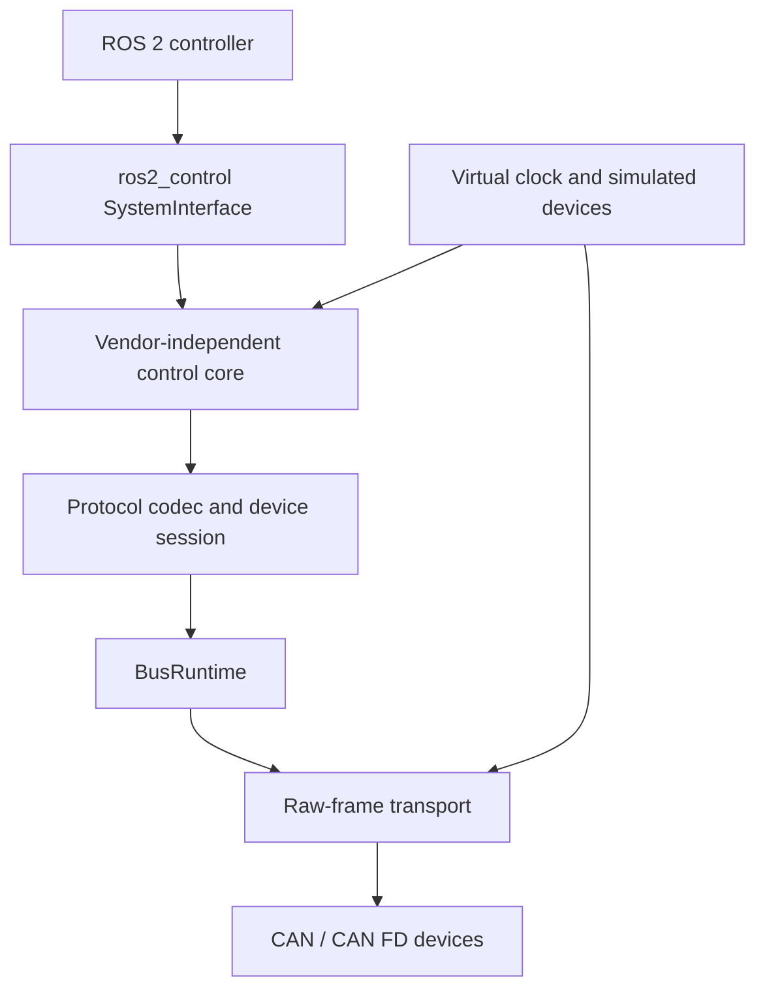

# Jetson Mechatronic Control Framework

面向 NVIDIA Jetson 与 ROS 2 的机电设备控制框架。项目以供应商无关的 C++ 核心为基础，通过统一的传输、协议和设备会话边界接入 CAN/CAN FD 电机与传感器，并以 `ros2_control` 提供标准化的控制接口。

本项目当前处于研究开发阶段。硬件无关的 Foundation 与仿真链路已经建立，CubeMars AK3.0 等设备适配器正在按证据门控流程开发；真实电机与传感器的部署仍需完成逐台设备取证、总线验证和台架安全验收。

## 设计目标

- **供应商解耦**：控制器、`ros2_control` 适配层、设备协议和底层传输分别演进，新增设备无需修改通用控制核心。
- **确定性与可测试性**：纯 C++ 核心不依赖 ROS 运行时，支持虚拟时钟、模拟设备、故障注入和无硬件测试。
- **明确的实时边界**：每条物理总线由一个 `BusRuntime` 统一拥有写入权，命令租约、状态新鲜度和看门狗使用单调时间语义。
- **保守的硬件激活**：未知的设备参数、协议能力或物理映射不会被默认值掩盖；未满足证据与安全闸门时拒绝激活。
- **可扩展部署**：统一的原始帧接口支持 Fake、SocketCAN/vcan 以及能力受控的 USB-CDC 传输路径。

## 架构概览



架构遵循以下核心约束：

- 通用核心只处理帧、时间、配置、能力、路由、状态快照、命令租约与总线运行时，不包含供应商位域。
- `ros2_control` 插件仅负责生命周期和标准接口映射，不在实时 `read()` / `write()` 路径中执行阻塞 I/O。
- 协议 profile 在配置阶段固定，运行期间不自动探测或切换。
- 传输后端必须如实报告时间戳、过滤、位速率和错误能力，不合成无法验证的能力。
- 设备反馈、命令和故障状态均受新鲜度、超时和锁存规则约束。

完整接口约束见 [AdapterContract v1](docs/development/adapter_contract_v1.md)，架构决定见 [ADR 索引](docs/adr/README.md)。

## 当前能力

已实现并纳入自动化验证的主要能力包括：

- ROS 无关的 C++17 控制核心与配置校验；
- 标准帧、扩展帧、Classic CAN 与 CAN FD 数据模型；
- 冲突检测、帧路由、状态快照、命令租约和分级看门狗；
- 单物理通道单写者的 `BusRuntime`；
- 确定性虚拟时钟、Fake transport、模拟设备与故障注入；
- SocketCAN/vcan 路径和可注入串口的 USB-CDC 帧传输实现；
- 复合 `ros2_control::SystemInterface` 与有界 C++ controller 插件；

以下内容尚不属于已完成能力：

- 真实 CubeMars 电机或 HI12 传感器的即插即用部署；
- 未经验证的 CAN ID、位速率、方向、减速比、力矩常数或安全限值；
- 真实硬件上的频率、实时性、力矩精度或长期稳定性承诺；
- 自动修改 Jetson 系统、CAN 接口或设备固件。

## ROS 2 包

| 包 | 职责 |
|---|---|
| `mech_control_core` | 帧、时间、配置、能力、路由、状态快照、命令租约和总线运行时 |
| `mech_simulation` | 虚拟时钟、Fake transport、参考设备与确定性故障测试 |
| `mech_hardware_ros2_control` | 连接通用核心的复合 `ros2_control` 硬件插件 |
| `mech_controllers` | 带边界、变化率和超时约束的 C++ controller 插件 |
| `mech_bringup` | 仿真与部署组合、URDF/xacro、launch 和 controller 配置 |
| `mech_protocol_cubemars` | CubeMars AK3.0 力控 profile：wire 编解码、证据门映射、会话与看门狗 |

`mech_protocol_cubemars` 是本分支新增的第六个包：CubeMars AK3.0 力控 profile 的实现，已在单电机取证台架上完成真机闭环验证（力矩、速度、位置三个子模式）。真实设备激活仍受硬件安全闸门（G0–G3）与 ADR-006 约束；HI12 等其他供应商协议包仍推迟。

## 环境要求

- Ubuntu 22.04
- ROS 2 Humble
- 支持 C++17 的编译器
- `colcon`、`rosdep` 和 CMake/ament 构建工具

目标平台为 NVIDIA Jetson ARM64；日常开发和 CI 也可在满足上述版本约束的 x86_64 主机上进行。Windows 仅作为编辑和 Git 环境，不用于形成 ROS 2、vcan、性能或 ARM64 验证结论。

## 构建与测试

在仓库根目录执行：

```bash
source /opt/ros/humble/setup.bash
rosdep update --rosdistro humble
MECH_OUTPUT_ROOT=/tmp/jetson-mech-control-build \
  bash tools/ci/build_workspace.sh
```

该脚本会解析 ROS 依赖、构建全部包并运行测试。构建过程不会启用 CAN、打开真实设备或修改 Jetson 配置。更多主机配置与输出目录选项见 [ROS 2 workspace 说明](ros2_ws/README.md)。

可单独运行文档和仓库一致性检查：

```bash
python3 tools/ci/context_check.py
python3 tools/ci/check_adrs.py
git diff --check
```

## 硬件安全边界

真实设备接入不是普通构建步骤。任何 CAN 启用或非零电机命令都必须经过分阶段验收：

| 闸门 | 最低要求 |
|---|---|
| G0：设备身份 | 确认型号、固件、协议 profile、节点 ID、位速率和关键参数 |
| G1：被动总线 | 确认接线、终端、通道映射、帧格式以及 ID/位速率无冲突 |
| G2：反馈验证 | 在不发送运动命令的前提下获得稳定且语义明确的反馈与故障状态 |
| G3：台架安全 | 完成固定、限位、断能、限流、看门狗和最小命令策略检查 |

通过软件测试或 ARM64 构建不等于通过硬件激活闸门。当前单通道部署边界记录在 [ADR-006](docs/adr/ADR-006-conditional-can0-deployment.md)，其状态仍为 **Proposed**。

## 文档导航

- [贡献指南](CONTRIBUTING.md)：分支、Issue、Pull Request、验证和信息边界
- [架构决策记录](docs/adr/README.md)：已接受及待验证的架构约束
- [AdapterContract v1](docs/development/adapter_contract_v1.md)：协议适配器与通用核心的冻结接口
- [规划与证据索引](docs/planning/README.md)：项目路线、硬件闸门和资料来源
- [Foundation 实施计划](docs/planning/07_framework_bootstrap_plan.md)：框架范围与验收标准
- [AI 协作约定](AGENTS.md)：使用 AI 工具参与本仓库开发时必须遵循的流程

## 许可证与第三方资料

本仓库当前采用[内部研究用途声明](LICENSE-or-INTERNAL-LICENSE.md)，并非开放源代码许可证。未经项目负责人及相关机构书面许可，不得重新分发、公开发布、再许可或用于商业用途。

第三方依赖和供应商资料遵循各自许可证与分发限制。资产登记和纳入策略见 [`manifests/assets.yaml`](manifests/assets.yaml)；原始供应商资料、实验数据和生成产物不属于可提交的主仓库内容。
