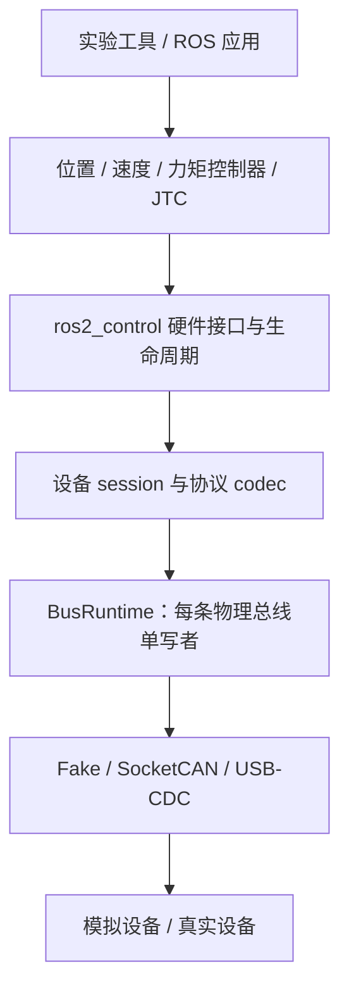

# Jetson Mechatronic Control Framework

**面向 NVIDIA Jetson 的机电控制框架：C++17 核心、ROS 2 Humble、ros2_control，以及可追溯的电机实验工具。**

项目将控制器、设备协议与 CAN 传输分离，既支持无硬件仿真和故障测试，也已接入 CubeMars AK3.0 力控与位置伺服。当前主要应用是两台电机的标定、角度控制和实验记录；位置、速度、力矩控制器及标准轨迹控制器也已有实现和各自的台架验证。

[能力与进度](#当前能力与完成程度) · [台架与CAN-ID](#当前台架与-can-id) · [伺服控制](#双电机伺服控制) · [力控与调参](#力控使用与调参) · [构建](#构建与测试) · [文档](#文档导航)

## 当前能力与完成程度

| 功能 | 现在能做到什么 | 验证范围与剩余工作 |
|---|---|---|
| 通用控制基础 | 单调时钟、帧路由、状态快照、命令租约、每条物理总线单写者、故障锁存 | Foundation RC2 已完成，具有模拟、vcan、ARM64 与历史稳定性验证 |
| 位置控制器 | 通过位置目标、目标限幅和斜坡驱动 AK3.0 力控 Position 子模式 | 已进行单电机保持、步进和增益试验；实际误差取决于增益、摩擦与负载 |
| 速度控制器 | 给定 rad/s 目标，限制目标加速度，持续刷新并在正常结束时斜坡回零 | 已完成零速和正向速度台架试验；尚不代表高精度恒速或全部方向验收 |
| 力矩控制器 | 给定 N·m 目标，限制力矩变化率，执行原始 ERPM 超速保护 | 已完成零力矩及非零力矩响应、超速锁存试验；力矩反馈是电流换算值，非独立计量 |
| 标准 JTC 轨迹 | 通过 FollowJointTrajectory 运行位置轨迹，力控路径可调整 Kp/Kd | 已完成真实动作及标准控制器接入；精确跟踪、顿挫根因和完整停止验收仍未关闭 |
| 双电机位置伺服 | 104/105 绝对角度、相对增量、原位保持、停用后再使能、逐台失能确认 | 已完成单路双机及独立双路适配与记录范围内台架试验，项目负责人确认实际脚本实验通过 |
| 位置＋速度／前馈力矩 | 硬件接口支持 Position 模式的整组目标，具有独立辅助目标限幅 | 接口及离线集成已实现；完整阻抗控制器、自动重力补偿尚未实现 |
| 诊断与证据 | 保存配置、目标、反馈、框架日志、有界命令链与原始串口记录；独立审计和离线归档 | 可定位主机链路和观察端差异；串口写入成功不能证明 CAN 送达或电机执行 |
| 传输与扩展 | Fake、SocketCAN/vcan、USB-CDC 后端；Classic CAN / CAN FD 帧模型 | 已有后端能力不等于所有通信板均通过验收；HI12、统一安装初始化与完整 MVP 仍待推进 |
| STM32 传感器节点 | 通过 SocketCAN 或 USB-CDC 接收两路 IMU、左右足底 20 点压力和设备时间戳 | 保持只接收，不接管电机；检测链路超时、CRC 和字段有效性，旧 196 字节协议无法证明单路 IMU 后续是否冻结 |

**当前可直接使用的已迁移部署是双路伺服。** 旧力控位置、速度和轨迹工具仍保留在 Jetson 上，但使用各自的旧发布版和配置，不自动读取双路伺服配置。软件具备力控能力，不表示旧工具已迁移到现在的接线和零点，具体区别见下文。

500 Hz 是现有控制组合的配置频率，不是经过认证的硬实时保证。双路实验通过也不等于原单 CAN 目标串错问题的根因已经关闭。当前任务与历史验收证据见[规划索引](docs/planning/README.md)。

## 当前台架与 CAN ID

以下为 **2026-10-08 核对的部署配置**。电机节点 ID、伺服映射及通道对应关系已确定；不再把它们列为该台架的未知参数。换设备、改零点或改 USB 拓扑后需要重新核对。

### 接线与坐标

Jetson 经 USB 连接 Livelybot 通信板，两台电机分别接入独立 CAN 通道。配置保存在部署根目录 `config/servo_pair.json`，采用 schema 2；一个 controller_manager 和一个 JTC 管理两个硬件实例。

| 配置项 | 电机 104 | 电机 105 |
|---|---|---|
| 节点 ID（十进制 / 十六进制） | `104` / `0x68` | `105` / `0x69` |
| ROS 关节名 | `motor104_joint` | `motor105_joint` |
| `logical_bus` | `2` | `1` |
| USB by-path 末段 | `3.4.2:1.2` | `3.4.2:1.0` |
| 保存的设备角度范围 | `0～220°` | `0～210°` |
| ROS 位置范围 | `0～3.839724354 rad` | `0～3.665191429 rad` |
| 目标 / 反馈偏移 | 均为 `0` | 均为 `0` |

完整串口路径分别是：

```text
104: /dev/serial/by-path/platform-3610000.usb-usb-0:3.4.2:1.2
105: /dev/serial/by-path/platform-3610000.usb-usb-0:3.4.2:1.0
```

`logical_bus` 是软件配置中的逻辑编号，不应直接当作板上丝印端口号。使用上述稳定路径，不依赖可能随枚举变化的 `ttyACM*` 编号。

当前伺服坐标按设备度数与 ROS 弧度转换：目标比例 `180/π`，反馈比例 `π/180`。范围来自操作者在厂家工具设零后的测量，操作者已确认重复掉电后的零点稳定；保持零点、安装和映射不变时复用保存值，无需每次重新标定。这不等于已完成整机运动学或双电机组合碰撞包络认证。

### 节点 ID 与报文 ID

AK3.0 扩展 CAN ID 由功能号和节点号组合：`(功能号 << 8) | 节点ID`。同一台电机的不同功能使用不同报文 ID。

| 报文用途 | 功能号 | 电机 104 | 电机 105 | 数据长度 |
|---|---|---|---|---|
| 伺服位置命令 | `0x06` | `0x668` | `0x669` | 8 字节 |
| 力控命令：位置 / 速度 / 力矩子模式 | `0x08` | `0x868` | `0x869` | 8 字节 |
| 周期反馈 | `0x29` | `0x2968` | `0x2969` | 8 字节 |
| 伺服失能命令 | `0x0F` | `0xF68` | `0xF69` | 0 字节 |

上表是协议与已配置节点的对应关系，**不是裸报文发送教程**。实际操作由框架处理编码、反馈、租约和失能确认；当前两台电机使用伺服 profile，不能在运行中混发力控报文。位速率及 backend 能力是独立参数，不能由 ID 或串口波特率推导。

## 双电机伺服控制

### 操作入口

以下入口位于已经安装好的 Jetson 部署目录 `~/jetson_mech_control`。普通源码 clone 不会自动生成这些入口和现场标定。

| 入口 | 用途 |
|---|---|
| `./servo-status` | 独占监视设备角度、ERPM、电流 Iq、温度、状态与反馈新鲜度 |
| `./servo-range` | 采集范围并保存标定，不设置电机零点或写 Flash |
| `./servo-control` | 启动基于标定生成的框架，轨迹控制器初始 inactive |
| `./servo-move` | 启动交互实验窗口，自行管理框架、轨迹和退出清理 |

同一时刻只运行一个入口。伺服交互窗口内已有位置反馈，不需要另开 `servo-status` 抢占串口。

### 一次实验的顺序

先检查配置，观察角度，并退出监视：

```bash
cd ~/jetson_mech_control
./servo-move check       # 离线检查，不打开串口
./servo-status           # 观察完成后按 Ctrl+C 退出
./servo-move             # 等待控制器就绪及有效反馈
```

随后在交互窗口输入：

| 命令 | 含义 |
|---|---|
| `enable` | 获取新鲜位置，使能并保持当前位置 |
| `move <104角度> <105角度> <秒数>` | 设备绝对角度目标，单位为度 |
| `step <104增量> <105增量> <秒数>` | 从本次实际反馈出发的相对移动，单位为度 |
| `stop` | 取消旧轨迹并请求保持当前位置，仍可输出力矩 |
| `disable` | 逐台确认失能，保留交互窗口，再次 `enable` 会重新获取反馈 |
| `quit` | 失能并退出；已成功失能时不重复发送 |

例如，在当前实际角度加 2° 仍处于允许范围、机构也允许该动作时：

```text
enable
step 2 0 3
disable
quit
```

此例让 104 的目标在 3 秒内增加 2°，105 保持本次读到的位置。应逐条输入并等待动作完成。`step` 不以旧目标累加，`move` 不表示增量；双路接线下参数仍始终按 **104、105、秒数** 排列。移动时间允许 0.5～60 秒，动作未完成时拒绝新的移动指令。

只选 105 可运行 `./servo-move --motor-id 105`，此时语法为 `move <角度> <秒数>` / `step <增量> <秒数>`。当前没有等价的 `--motor-id 104` 单机选择入口。

### 伺服参数与力控增益的区别

当前伺服配置中，每台电机的 `speed_erpm=100`、`acceleration_raw=100`、`position_max_error_rad=0.25`，目标与反馈映射均已显式确认。它们分别属于设备速度参数、设备原始加速度参数和主机位置偏差保护；不是 Kp/Kd，也不能直接当作输出轴 `100°/s` 或 `100°/s²`。

`move/step` 的时间控制主机轨迹，实际响应还受设备参数和机械负载影响。`servo-move` 不提供在线 Kp/Kd 调节，力控调参命令也不改变当前伺服配置。修改伺服参数应在控制完全退出后进行，再离线 `check`；坐标、零点或安装改变时重新核对标定。

退出时需检查失能结果。`stop`、停止发送、控制器 inactive、进程退出和设备失能是不同状态；设备失能确认也不等于机械制动。详细退出与异常恢复流程见[伺服工具说明](tools/servo/README.md)。

## 力控使用与调参

### 三种子模式控制什么

AK3.0 力控报文同时携带位置、速度、Kp、Kd 和前馈力矩。其名义控制关系为：

```text
τ = Kp × (q_des − q) + Kd × (v_des − v) + τ_ff
```

这里描述的是力控关系；具体数值由适配器按已确认坐标和协议单位映射。ROS 标准接口使用 rad、rad/s、N·m。电流换算力矩不等于独立测量的实际负载力矩。

| 子模式 | 主要目标 | 增益作用 | 本项目入口 |
|---|---|---|---|
| Position | 位置；可选期望速度和前馈力矩 | Kp 产生位置恢复作用，Kd 作用于速度误差 | PositionCommandController 或 JTC |
| Velocity | 速度 | Kp=0，以 Kd 作用于速度误差，运行时强制前馈为 0 | VelocityCommandController |
| Torque | 前馈力矩 | Kp=Kd=0，直接使用 effort 目标 | EffortCommandController |

只发送位置目标时，期望速度和前馈力矩为零，Kd 主要提供阻尼。增大 Kp 可能减小负载或摩擦造成的位置误差，也会提高同等偏差下的力矩请求；Kd 会改变阻尼和动态响应。纯力矩模式不是恒速模式：空载轴可能持续加速，零力矩也不能保证停转。

### 先确认旧力控部署的适用范围

Jetson 保留三个入口：`current/operator/mech`、根目录 `velocity` 和根目录 `trajectory`。它们属于以前的单电机 `motor1` 台架，不使用 `config/servo_pair.json`。

2026-10-08 只读核对发现，旧位置工具仍为 `drive_id=104`、Kp/Kd=`8/1`，串口为旧 `...2024051701-if00` by-id 路径，`zero_offset_rad=5.760604931781636`。这些值不能套到当前双路伺服的零偏移坐标。**下面列出已有工具的用法；若要在当前接线下重用，必须先迁移该力控部署的串口、身份和坐标映射并验证。** 本 README 更新不修改现场部署，不执行任何电机动作。

### 位置控制与固定增益

在完成匹配的单电机部署后：

```bash
cd ~/jetson_mech_control/current/operator
./mech check
./mech hold             # 以本次实际位置为目标，保持约 3 秒
./mech custom 5         # 相对本次起点 +5°，不是绝对 5°
```

`hold`、`step`、`custom` 自行管理启动与结束，不要先手动 launch。旧工具的 `custom` 接受 ±45° 内目标，目标斜坡为 5°/s；这些是工具的输入范围，不是整个范围的实机精度验收。保持目标必须取本次新鲜位置，不能复制历史绝对角度。

位置工具的 Kp/Kd 保存在 `current/operator/motor1_bench.urdf` 的 `<param name="kp">`、`<param name="kd">`。彻底退出控制后修改，运行 `./mech check` 检查，下一次启动生效，无需重编译；不是用 `ros2 param set` 动态修改。不要把增益写进控制器 YAML，那里管理的是目标边界、斜坡和超时。

历史同一小步进试验中，Kp 从 2、4 调到 8（Kd=1），实际位移随之增大，但这些数据来自旧电机配置和旧目标斜率，不能当作当前双电机的推荐增益。

### 用 JTC 做可重复的 Kp/Kd 对照

在完成匹配的力控轨迹部署后，从根目录运行：

```bash
cd ~/jetson_mech_control
./trajectory check
./trajectory observe    # 打开设备接收反馈，确认静止
./trajectory run 6 1    # 本轮 Kp=6、Kd=1，启动一次真实动作
```

`run` 每次测量新起点，4 秒前进约 10°，保持 1 秒，再用 4 秒返回起点目标。省略增益默认 `6/1`；传入的增益仅对本轮生效。允许 Kp 为 `0～18`、Kd 为 `0～5`，不用手动改 URDF或重编译。`check` 不打开设备；`observe` 是接收观察；`run` 会使能控制并运动。

该工具把硬件位置误差门限设为：Kp≤10 时 `0.3 rad`，Kp>10 时 `1.8/Kp rad`。例如 Kp=18 时为 `0.1 rad`。这是名义比例项的约束，不包含阻尼与前馈，也不是总力矩保证。历史 `18/5` 对照改善过部分顿挫指标，但顿挫未消除、立即停止检查仍有失败，因此不能把最大增益写成推荐值。

一次调参应保持相同起点附近、负载、位移与时间，先选小幅动作，再一次只改 Kp 或 Kd，对比实际位置、最大跟随误差、超调、振动和停止表现。若位置误差保护触发，先核对映射、增益、目标速度和负载，不通过放宽门限来掩盖问题。动作返回成功只说明流程判据通过，不代表跟踪误差为零。

### 速度控制

旧速度工具的使用形式是：

```bash
cd ~/jetson_mech_control
./velocity check
./velocity zero         # 使能零速测试，不是被动读取
./velocity run 0.4 5    # 目标 0.4 rad/s，达到目标后的保持时间 5 秒
```

工具允许 ±0.4 rad/s、保持 0.2～5 秒，默认也是 `0.4 5`；控制器示例限制为 ±0.5 rad/s、目标加速度 0.5 rad/s²。正常结束持续发布零目标，经斜坡回零后确认实际速度，再停用。速度模式没有角度终点。

历史正向 `0.4 rad/s × 5 s` 试验完成响应和回零停用，保持段平均实测速度约 `0.207 rad/s`，说明功能链路已跑通，但不能称为精确恒速。旧工具 Kp=0、Kd=1，扩大速度范围或调整 Kd 需要制作并验证新发布版；其文件具有哈希保护，不应直接修改文件或清单绕过校验。

### 力矩控制与 ROS 开发接口

仓库具有 `EffortCommandController`、[Torque 硬件配置](ros2_ws/src/mech_bringup/config/motor1_torque.urdf.xacro)与[力矩控制器配置](ros2_ws/src/mech_bringup/config/motor1_effort_controllers.yaml)，但当前部署根目录没有已确认的 `./effort` 快捷入口。不要把源码能力写成不存在的命令。

| 控制器实例 | 目标接口（`std_msgs/msg/Float64`） | 单位 | 仓库示例约束 |
|---|---|---|---|
| `motor1_position_controller` | `/motor1_position_controller/target_position` | rad | 目标范围 −12～6，变化率 2 rad/s；旧 motor1 示例 |
| `motor1_velocity_controller` | `/motor1_velocity_controller/target_velocity` | rad/s | ±0.5，变化率 0.5 rad/s² |
| `motor1_effort_controller` | `/motor1_effort_controller/target_effort` | N·m | ±0.1，变化率 0.2 N·m/s |

三个控制器目标都需要持续刷新，同值新消息也能刷新有效期；一次性发布不能替代持续控制程序。示例上游目标软/硬超时为 `100/106 ms`，硬件命令租约为 `4/6 ms`，力控反馈新鲜度为 `60 ms`。目标失效或停用不会自动合成制动力矩。控制器默认 inactive，但真实 bringup 的 configure 仍会打开设备。

Torque 模式必须配置 `torque_max_abs_erpm`，仓库示例为 `300`；阈值监测原始电气转速，触发后锁存并停止提交命令，不是主动制动。历史独立 +0.2 N·m 空载试验在克服静摩擦后加速，触发当次配置的 5000 ERPM 阈值；这是保护行为证据，不是应把当前阈值提高到 5000 的建议。标准 position/velocity 在该模式下没有可用测量语义，不能用占位零值判断静止。

### 参数改在哪里

| 想调整什么 | 对应位置 | 注意事项 |
|---|---|---|
| 力控 Kp/Kd、子模式、设备映射 | 部署 URDF 的硬件参数；轨迹工具也支持本轮命令行增益 | 固定于运行配置，不支持 ACTIVE 期间热切换 |
| 目标上下限、斜坡、目标超时 | `mech_bringup/config/*_controllers.yaml` 中对应控制器参数 | 目标限制不等于物理限位；修改超时不能作为调参手段 |
| 绝对位置范围、最大跟随偏差 | 硬件参数 `position_min_rad` / `position_max_rad` / `position_max_error_rad` | 越界拒绝并锁存，不静默裁剪 |
| Position 期望速度、前馈上限 | `position_max_abs_velocity_rad_s` / `position_max_abs_feedforward_nm` | 默认 0 表示禁用；声明辅助接口时必须给出正上限 |
| 当前伺服角度范围、总线和设备速度参数 | 部署 `config/servo_pair.json` | 与旧力控配置独立，修改后重新检查 |

硬件支持 `position`、`position+velocity`、`position+effort`、`position+velocity+effort` 等固定接口组合。Humble 标准 JTC 可用位置＋速度组合，不能直接驱动完整位置＋速度＋力矩组合；完整组合须由兼容的单个控制器统一写入。本项目尚未提供自动重力模型或完整阻抗控制器，详见[期望速度与前馈设计](docs/development/position_feedforward_design.md)。

## 构建与测试

环境要求：Ubuntu 22.04、ROS 2 Humble、C++17 编译器、CMake/ament、colcon，以及完成初始化的 rosdep。目标平台为 Jetson ARM64，匹配环境的 x86_64 用于开发和 CI。Windows 用于编辑和 Git；ROS、vcan 与性能结论来自相应 Linux 环境。

从源码仓库根目录运行：

```bash
source /opt/ros/humble/setup.bash
rosdep update --rosdistro humble
MECH_OUTPUT_ROOT=/tmp/jetson-mech-control-build \
  bash tools/ci/build_workspace.sh
```

脚本解析依赖、构建八个包并运行测试，测试使用模拟设备和虚拟串口。依赖解析可能安装系统软件包；已配好依赖时可设置 `MECH_SKIP_ROSDEP=1`。普通 clone 不包含现场部署入口、标定或实验记录。持久部署使用 symlink-install 时，源码、build 和 install 必须一起保留，不能仅搬动 install。

文档与仓库检查可单独运行：

```bash
python3 tools/ci/context_check.py
python3 tools/ci/check_adrs.py
git diff --check
```

CI 先检查文档链接、Python/Bash 语法和仓库约束，再在原生 x86_64、ARM64 上分别构建八个包并测试；独立 ASan/UBSan 任务检查内存和未定义行为。宿主使用 Ubuntu 24.04，构建环境仍是固定的 Ubuntu 22.04／ROS 2 Humble 容器。依赖缓存按架构分开，测试复用已构建产物，源码变化时拒绝直接复用旧构建。

构建失败或测试失败都会尝试保存日志、XML 和状态报告，诊断产物保留 14 天，并列出实际跳过项。测试容器提供相应调度权限和共享内存；不会放宽生产保护时限来让测试通过。CI 使用模拟设备与虚拟串口，独立于现场 Jetson 的运行状态。复现步骤见 [ROS workspace](ros2_ws/README.md)，实际云端运行结果见 [GitHub Actions](https://github.com/Makoto20S/jetson_mech_control/actions/workflows/foundation.yml)。构建和自动化测试不能替代现场验收。

## 架构与源码入口


```mermaid
flowchart TD
    App[实验工具 / ROS 应用] --> Controller[位置 / 速度 / 力矩控制器 / JTC]
    Controller --> Hardware[ros2_control 硬件接口与生命周期]
    Hardware --> Session[设备 session 与协议 codec]
    Session --> Runtime[BusRuntime：每条物理总线单写者]
    Runtime --> Transport[Fake / SocketCAN / USB-CDC]
    Transport --> Device[模拟设备 / 真实设备]
```

通用核心不依赖 ROS 运行时，不包含供应商位域；控制器不直接打开串口或编码 CAN 帧。协议 profile 在配置时固定，实时 read/write 不执行阻塞设备 I/O。传输后端如实报告时间戳、位速率、过滤和错误能力，未知能力不由默认值伪造。

| ROS 包 | 职责 |
|---|---|
| [`mech_control_core`](ros2_ws/src/mech_control_core) | 帧、时间、配置、路由、状态、命令租约、BusRuntime |
| [`mech_simulation`](ros2_ws/src/mech_simulation) | 虚拟时钟、模拟设备、Fake transport、故障注入 |
| [`mech_hardware_ros2_control`](ros2_ws/src/mech_hardware_ros2_control) | 通用复合硬件插件及接口映射 |
| [`mech_controllers`](ros2_ws/src/mech_controllers) | 有界位置、速度、力矩控制器与目标有效期 |
| [`mech_protocol_cubemars`](ros2_ws/src/mech_protocol_cubemars) | AK3.0 力控/伺服编解码、映射、session、看门狗 |
| [`mech_protocol_ctrboard`](ros2_ws/src/mech_protocol_ctrboard) | STM32 遥测分片重组、CRC 校验和 196 字节传感器协议解码 |
| [`mech_ctrboard_bridge`](ros2_ws/src/mech_ctrboard_bridge) | 将 STM32 作为只接收传感器设备接入 ROS 2，并发布 IMU/足底压力与安全诊断 |
| [`mech_bringup`](ros2_ws/src/mech_bringup) | 真实设备组合、硬件插件、URDF、launch 与集成测试 |

协议包本身不做设备 I/O。电机实际组合在 `mech_bringup`；STM32 由独立的 `mech_ctrboard_bridge` 节点只读接入，不改变电机总线所有权。双路伺服由一个 manager/JTC 驱动两个 `Ak30ServoSystem`，每个实例有独立串口和总线运行时，反馈聚合、失能逐路尝试。

## 实验记录与验证边界

伺服记录在部署目录 `runs/servo/move-*`，再次使能的后台有独立子目录。主要文件包括 `config.json`、`events.jsonl`、`framework.log`、`command-chain.jsonl.gz`、`serial-trace.jsonl.gz`、`capture-manifest.json` 和失能记录。双路快照按总线区分；先判断完整性，再解释数据。

力控位置工具会打印本次 evidence 目录；速度记录在 `velocity-current/operator/velocity-*`，轨迹记录在 `trajectory-current/runs/`。实际判断应同时查看目标、反馈、动作结果和退出结果，不能只看进程返回 0。

新设备或新部署仍需按 [ADR-006](docs/adr/ADR-006-conditional-can0-deployment.md) 核对 G0 设备身份、G1 接线和总线条件、G2 反馈语义、G3 台架固定/限位/断能等要求。该 ADR 最终部署状态仍为 Proposed，已有独立台架结果不替代最终系统验收。当前台架已确认的 ID 与映射可以复用；现场状态和新的运动操作仍需当次确认与授权。

## 文档导航

| 需求 | 入口 |
|---|---|
| 伺服操作、双路配置、标定、故障退出和日志恢复 | [伺服工具说明](tools/servo/README.md) |
| 力控运行时、标准 JTC、模式反馈及台架证据 | [mech_bringup](ros2_ws/src/mech_bringup/README.md) |
| 控制器目标、限幅、超时和停止语义 | [mech_controllers](ros2_ws/src/mech_controllers/README.md) |
| 协议编码和设备会话 | [CubeMars 协议包](ros2_ws/src/mech_protocol_cubemars/README.md) |
| STM32 IMU/足底压力接入与安全状态 | [CtrBoard ROS 2 桥](ros2_ws/src/mech_ctrboard_bridge/README.md) · [实机验证记录](docs/development/ctrboard_hardware_validation.md) |
| 位置伺服 profile 与验收要求 | [伺服设计](docs/development/ak30_servo_position_design.md) |
| 期望速度与前馈力矩接口 | [Position 扩展设计](docs/development/position_feedforward_design.md) |
| 构建、测试和 CI 复现 | [ROS workspace](ros2_ws/README.md) |
| 新设备适配、架构约束 | [AdapterContract v1](docs/development/adapter_contract_v1.md) · [ADR 索引](docs/adr/README.md) |
| 当前进度和后续工作 | [规划索引](docs/planning/README.md) |
| 贡献代码和 AI 协作 | [贡献指南](CONTRIBUTING.md) · [AGENTS.md](AGENTS.md) |

开发采用短生命周期任务分支，通过 PR 合入 main。共享事实保存在代码、配置、测试与正式文档中；本地 memory、实验原件和临时产物不提交。

## 许可与第三方资料

本仓库采用[内部研究用途声明](LICENSE-or-INTERNAL-LICENSE.md)，并非开放源代码许可证。重新分发、公开发布、再许可或商业使用须取得项目负责人及相关机构的书面许可。第三方资料遵循各自许可，资产边界见 [`manifests/assets.yaml`](manifests/assets.yaml)。
