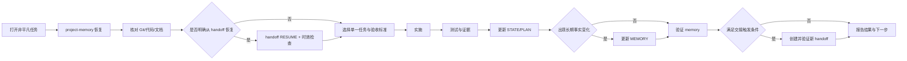

# AI 协作与上下文连续性标准 v1

> 状态：Accepted for planning and Foundation work
> 日期：2026-08-03
> 适用对象：所有使用 AI 参与本仓库规划、开发、评审、验证和交接的人员
> 强制入口：仓库根 `AGENTS.md`

## 1. 目标与原则

本标准解决三个长期问题：新对话如何可靠恢复、项目状态如何持续维护、工作如何在人员/机器/阶段之间安全交接。

核心原则是：**仓库事实优先，memory 持续维护，handoff 按事件创建，skill 只是执行流程的工具。** 对话内容不是项目数据库，handoff 也不是代码和 Git 的替代品。

## 2. 信息分层

| 载体 | 用途 | 更新方式 | 不应包含 |
|---|---|---|---|
| 代码、配置、测试、ADR、Git | 可执行且可审查的事实源 | 正常开发与评审 | 未验证结论、秘密 |
| `memory/MEMORY.md` | 长期稳定的架构、规则、约束和已确认决策 | 每个新项目任务结束/暂停时由 AI 自动检查；仅在 durable fact 改变时实际更新 | 临时进度、聊天记录、猜测 |
| `memory/STATE.md` | 可替换的当前工作快照 | 每个新项目任务结束/暂停时由 AI 自动更新 | 长期 backlog、完整日志 |
| `memory/PLAN.md` | 按优先级维护的未来任务 | 每个新项目任务结束/暂停时由 AI 自动更新；完成、取消或重排时同步调整 | 当前工作区细节、聊天历史 |
| `.codex/handoffs/*.md` | 跨上下文的不可变交接快照 | 仅在触发事件发生时新建 | 每轮流水账、秘密、隐藏推理 |
| AI 对话 | 讨论和执行界面 | 临时 | 唯一项目事实 |

`project-memory` 管理前三个 memory 文件的恢复、职责边界、检查点和验证。`write-codex-handoff` 管理 handoff 的创建、检查、恢复、时效与安全扫描。二者职责不同，不互相替代。

## 3. 标准状态机

## 4. 任务分级与 Skill 使用

| 任务类型 | `project-memory` | `write-codex-handoff` | 说明 |
|---|---|---|---|
| 简单问答、无新事实且不形成项目任务的只读查询 | 不使用 | 不使用 | 不制造无意义文档变更 |
| 任何非平凡新项目任务（调查、决策、验证、设计、代码或文档变更） | 必须；结束/暂停前自动更新并验证 Memory | 通常不使用 | 开始恢复，结束保存任务检查点 |
| 发现会影响后续工作的 durable fact | 必须并更新 `MEMORY.md` | 通常不使用 | 附证据和日期 |
| 用户要求继续一个普通未完任务 | 必须 | 仅当明确指定 handoff | 优先从 `STATE.md` 恢复 |
| 跨人员、机器、仓库阶段或长暂停 | 必须 | 事件触发时 CREATE | handoff 是转交包，不是日记；普通任务不自动创建 |
| 从指定 handoff 接手 | 必须 | 必须 RESUME | 先验证，再核对当前仓库 |
| 检查交接完整性、秘密或过期 | 按需 | 必须 CHECK | 失败时不得直接恢复 |

## 5. 新对话启动 SOP

### 5.1 能力检查

1. 检查 `project-memory` 和 `write-codex-handoff` 是否可用。
2. `project-memory` 对非平凡工作是必需能力；handoff skill 是条件式必需能力。
3. 读取 `manifests/ai_skills.yaml`。项目负责人已授权缺失时从清单中的两个准确 GitHub 仓库安装；优先安装 `verified_commit`，不从搜索结果、fork 或同名仓库替代。
4. 若远端 `main` 与已核验提交不同，记录实际 HEAD 并审查变化后再更新 manifest；没有 tag 时不得把移动分支描述成固定版本。
5. 若 skill 仍不可安装，明确告诉用户当前缺失项，并按本文件执行手工等价流程。不得新建 `notes.md`、`context.md` 等平行记忆文件。
6. 禁止依赖个人绝对路径作为团队标准；个人路径只能作为本机实际运行证据。

### 5.2 恢复顺序

1. 读取根 `AGENTS.md`。
2. 定位项目根并启动 `project-memory`。
3. 依次读取 `MEMORY.md`、`STATE.md`、`PLAN.md`。
4. 检查 Git root、branch、HEAD、status；需要时查看 diff。
5. 阅读 `docs/planning/README.md`、当前实施计划和任务相关 ADR/接口文档。
6. 若用户或 `STATE.md` 明确指出 handoff，执行 `RESUME`；否则不自动加载历史 handoff。
7. 对照权威顺序修正过期信息。
8. 选定一个任务 ID、范围、完成标准和验证命令，并向用户做简短开工说明。

### 5.3 恢复完成标准

AI 必须能够明确回答以下问题后才能修改项目：

- 本轮唯一目标是什么？
- 当前 branch/HEAD/dirty state 是什么？
- 最近已验证完成的结果是什么？
- 哪些状态来自用户、仓库证据、旧 handoff 或尚未验证的推断？
- 当前 blocker、风险和立即下一步是什么？
- 本轮允许修改哪些文件，禁止触碰哪些硬件或外部状态？

## 6. 执行与证据 SOP

1. 使用现有 Issue/里程碑编号；没有编号时先建立一个边界清晰的任务记录。
2. 编辑前检查目标文件和相邻约定，保留用户已有修改。
3. 设计、实现、测试和文档同时服从当前 ADR 与接口契约。
4. 结果声明使用明确证据：实际测试、Git diff、配置、日志摘要或当前文件路径。
5. 把“文件已修改”“结构校验通过”“项目行为已验证”“实机已验证”分开表述。
6. 外部仓库、远程机器、CAN 总线和硬件状态只在本轮重新检查后才能写为当前事实。
7. 每个未解决问题至少写清：现有证据、未解决原因、影响、下一动作和成功标准。

## 7. Project Memory 检查点 SOP

### 7.1 何时更新

每个新项目任务结束或暂停前创建检查点；无论任务是否修改代码，只要它形成项目状态、决策、验证或未完成事项，就必须保存当前状态。实现里程碑、重要调查结果、架构决策、验证状态变化、blocker 变化、方向变化和上下文疑似压缩属于必须特别检查的检查点。

### 7.2 如何更新

- `STATE.md`：每个新项目任务自动替换旧快照，写当前目标、完成结果、涉及文件、实际验证、问题和一个可执行的 `Immediate Next Action`。
- `PLAN.md`：每个新项目任务自动核对并更新；勾选已完成项，删除失效项，重排剩余任务，保留可观察的完成标准。
- `MEMORY.md`：每个任务自动检查是否出现新的长期确认事实；只有出现时才实际更新，不因普通进度变化而改写。
- 更新后运行 validator。结构通过不等于代码测试通过，两类结果必须分别报告。

### 7.3 检查点完成标准

另一个 AI 在不读取聊天记录的情况下，只依靠仓库、memory 和必要的 handoff，能够确定当前事实、未完成工作和下一条安全命令。

## 8. Handoff 生命周期 SOP

### 8.1 创建触发条件

仅在以下任一条件成立时 CREATE；普通任务完成或对话结束不得自行 CREATE：

- 用户明确要求写/创建交接文档或保存上下文；
- 工作转给另一位人员、另一台机器或另一套 workspace；
- 从规划进入实现、从 Foundation 进入设备接入、从模拟进入 HIL 等阶段切换；
- 长时间暂停或上下文压缩风险高；
- 存在未完成的高风险操作，需要把现场状态、失败证据和安全第一步交清楚。

普通对话结束、普通项目任务完成、已提交的小改动或已有有效 memory checkpoint，不单独触发 handoff。阶段切换、长暂停或高风险事件可以触发 AI 主动 CREATE，但必须在最终报告中说明触发原因。

### 8.2 创建规则

1. 先完成 project-memory checkpoint；handoff 引用它，不替代它。
2. 收集当前 Git、关键文件、实际验证和未知项。
3. 创建新文件，不覆盖已发布 handoff。
4. 重要结论标记证据类别；不复制聊天全文或隐藏推理。
5. 每个 unresolved item 写齐 evidence、reason、impact、next action、success criteria。
6. 运行结构/秘密 validator；有 error 时交接未完成。
7. 能检查 Git 时运行 staleness 检查；外部运行态始终标记可能过期。
8. 在最终回复中给出绝对路径、验证结果和最高优先级未决项。

### 8.3 恢复规则

1. 只恢复用户指定或明显对应当前任务的 handoff，不以文件名“最新”替代任务匹配。
2. 先验证结构和秘密，再检查 staleness。
3. 重读 metadata 中的 critical files，并重新检查 Git 和测试状态。
4. handoff 中的远程、进程和硬件状态默认过期。
5. 与当前仓库冲突时，以 `AGENTS.md` 第 1 节权威顺序为准。

## 9. 跨机器和跨 AI 的可移植性

单靠 skill 安装无法保证所有 AI 工具遵守流程，因此采用三层保障：

1. **仓库层**：`AGENTS.md` 和本文件提供工具无关规范，是最低共同协议。
2. **Skill 层**：支持 skills 的环境使用 `project-memory` 和 `write-codex-handoff` 执行标准化流程和 validator。
3. **CI/评审层**：FND-001/FND-003 后增加可移植的上下文检查，验证 memory 文件存在、结构有效、规划链接不失效，并检查 PR 是否说明验证与 memory 影响。

| 场景 | 仓库规则 | Skills | 实际保证 |
|---|---|---|---|
| 当前工作区中的新 Codex 对话 | Codex 会发现适用范围内的根 `AGENTS.md` | 已安装时可直接触发；缺失时按 manifest 安装 | 可以自动获得核心规则，但仍需按启动 SOP 核对当前文件和 Git |
| 新机器上的 Codex | FND-001 提交并推送后，clone 会带回 `AGENTS.md`、SOP 和 memory | 每个 Codex 环境需要安装或检查 skills | clone 前或 skills 未安装前不具备完整恢复能力 |
| 支持 `AGENTS.md` 约定的其他 AI | 取决于该产品的发现和作用域实现 | 通常不支持 Codex skill 格式 | 必须验证该产品实际行为，不能仅凭文件存在宣称已加载 |
| 不支持 `AGENTS.md` 的 AI | 不会自动加载 | 不会自动加载 | 使用第 12 节标准恢复口令，要求其先读取 `AGENTS.md` 和 SOP |

不要为未知工具预先复制多份完整规则。团队正式采用 Claude Code、Gemini CLI、Copilot、Cursor 等其他工具时，只增加该工具的最小入口文件，并让它指向 `AGENTS.md` 和本 SOP；核心规则仍只维护一份。

团队级 skill 不能只存在于某个用户目录。未来若创建项目 skill，其源码应进入仓库的受审查目录，记录来源/版本/安装方法，并保留本文件中的手工 fallback。

在 FND-000 批准后，建议把经过秘密审查的 `memory/` 随私有 Git 仓库同步，使它成为日常跨 AI、跨机器恢复路径。`.codex/handoffs/` 仍默认不批量进入主仓库；发生真实转交时，由负责人通过批准的私有渠道传递指定且已验证的 handoff，接收方再执行 `RESUME`。不得因为文件名较新就自动信任一个来源不明的 handoff。

`manifests/ai_skills.yaml` 已记录两个批准仓库、当前已核验提交和使用条件；当前仓库尚未初始化 Git，因此它还不是可通过 clone 获取的团队基线。FND-001 负责审查并纳入首次提交，FND-003 再用可移植 wrapper/CI 检查这些依赖和上下文文件。

## 10. 是否新增项目 Skill

### 10.1 当前决定

当前不新增 `jetson-project-memory`、`jetson-continuity` 或其他只负责串联现有两个 skill 的第三个 skill。原因是：

- 会重复 `project-memory` 和 `write-codex-handoff` 已有职责；
- 仍然依赖每台机器安装，不能替代根 `AGENTS.md`；
- 容易形成第三份状态或规则源；
- 当前流程尚未经过真实 Foundation 开发反复验证，过早固化会放大错误。

### 10.2 创建新 Skill 的门槛

只有同时满足以下条件才使用 `skill-creator` 创建项目 skill：

1. 同一人工 SOP 已成功执行至少三次；
2. 输入、输出、禁区和验收标准稳定；
3. skill 包含本项目独有知识或确定性脚本，而不是转述通用工程常识；
4. 可以用模拟/只读环境验证，不依赖未经授权的硬件动作；
5. 有明确 owner、版本策略、失败降级和仓库内手工 SOP；
6. skill validator 和至少一个真实使用样例通过。

### 10.3 后续候选顺序

| 候选 | 最早创建条件 | 价值 |
|---|---|---|
| `protocol-golden-frame` | codec schema 和 reference adapter 稳定 | 统一正/负/边界协议测试 |
| `can-capture-analyze` | 被动抓包 SOP 已重复验证 | 只读生成过滤、统计和证据摘要 |
| `hardware-bringup-gated` | G0-G3 已人工演练并有回滚 | 强制闸门和证据包，不自动越权操作 |
| `release-check` | CI、ADR、SBOM、ARM64/HIL 清单稳定 | 生成可审查的发布 readiness 报告 |

设备接入本身优先固化为 `AdapterContract v1`、package template 和测试，而不是立即包装成 skill。接口契约稳定后，再判断 `add-can-device-adapter` 是否达到上述门槛。

## 11. AI 任务完成定义

一次非平凡 AI 任务只有同时满足以下条件才算完成：

- 用户要求的结果已实现或明确说明 blocker；
- 相关检查实际运行，未运行项及原因已说明；
- 没有把文件修改冒充行为或实机验证；
- 重要决策进入 ADR/权威文档，而不是只留在对话；
- `STATE.md` 和 `PLAN.md` 已由 AI 自动更新并与当前事实一致；已检查是否需要更新 `MEMORY.md`，有长期事实变化时已更新；
- memory validator 无 error；
- 若触发交接，handoff validator 无 error；
- 最终答复给出结果、验证、剩余风险和一个具体下一步。

## 12. 标准恢复口令

新对话可以直接使用以下请求：

> 按根 `AGENTS.md` 开始工作。使用 `project-memory` 恢复当前项目，核对 Git 和当前实施文档，报告目标、状态、风险与 Immediate Next Action；只有存在明确 handoff 恢复事件时才使用 `write-codex-handoff`。不要在恢复阶段修改代码或硬件状态。

跨机器或换人时使用：

> 按根 `AGENTS.md` 从指定 handoff 恢复。先使用 `write-codex-handoff` 的 RESUME 流程验证结构和时效，再使用 `project-memory` 与当前 Git、关键文件和测试核对；报告差异后再执行任务。
