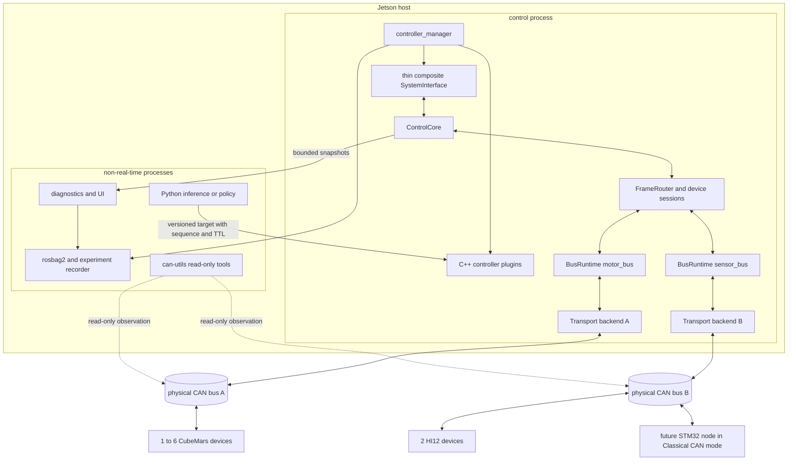
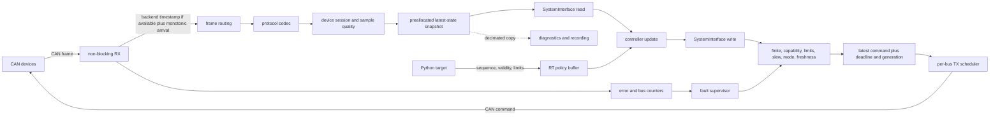
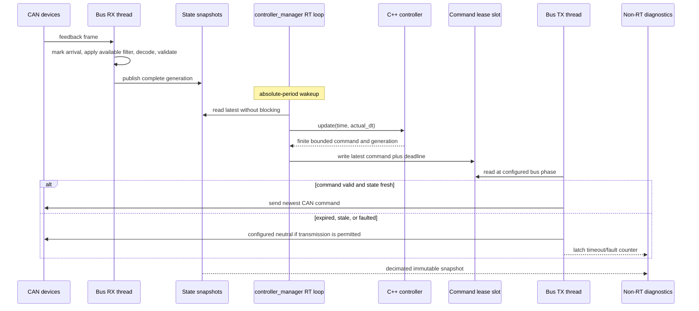
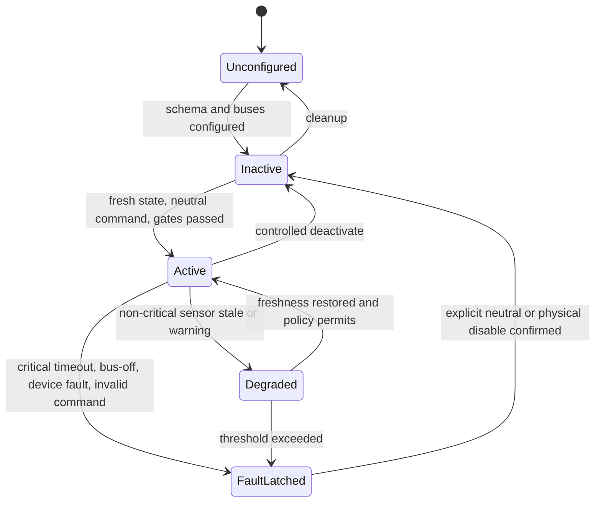
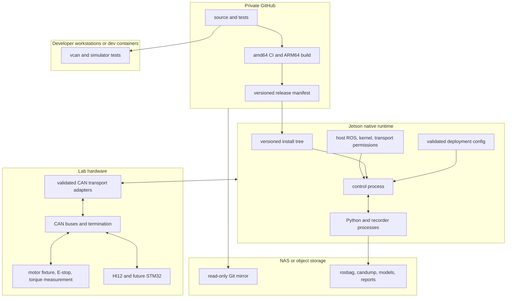

# 总体架构与接口设计

> FND-004 后收敛：当前规范决策见 [ADR 索引](../adr/README.md)。本文件只保留实现所需的架构背景、图示和接口细化；与 ADR 冲突时，以 ADR 的状态和正文为准。

## 1. 设计原则

| 原则 | 具体约束 | 性质 |
|---|---|---|
| 协议事实优先 | 型号、固件、模式、缩放、ID、位速率和力矩语义没有确认就不能给默认值 | 有依据的推断 |
| 确定性路径最小化 | 控制路径只含预分配 C++、最新状态快照、边界检查和非阻塞命令提交 | 有依据的推断 |
| 总线单写者 | 每条物理 CAN 由一个运行时发送控制命令并维护队列、时间和错误状态 | 有依据的推断 |
| 物理量诚实 | 只有经设备证据和校准成立的接口才使用 SI 物理量名称 | 有依据的推断 |
| 时间语义显式 | 采样时刻、内核接收时刻、主机单调到达时刻和控制时刻不互相替代 | 有依据的推断 |
| 生命周期可失败 | 配置、激活、切换和恢复都允许拒绝；失败时优先进入可解释的无命令/锁存状态 | 有依据的推断 |
| 无硬件也可测 | codec、路由、状态机和控制器必须可在单元测试、vcan 和模拟器上运行 | 有依据的推断 |
| 单发行版前进 | MVP 只支持 Humble；纯 C++ 核心避免 ROS API，以后迁移适配层，不维护多个长期分支 | 有依据的推断 |

## 2. 备选架构比较

FND-004 比较了三类方案：协议直接写入 hardware plugin、独立 CAN 网关经 DDS 进入闭环，以及纯 C++ 核心配薄 ros2_control 适配层。前两者分别会让厂商/总线逻辑侵入生命周期，或把 DDS、序列化与跨进程失效带入命令路径。

当前选择与替代方案的正式理由见 [ADR-001](../adr/ADR-001-core-boundary.md)、[ADR-002](../adr/ADR-002-bus-runtime-ownership.md) 和 [ADR-003](../adr/ADR-003-composite-system-interface.md)。独立网关只允许作只读诊断/记录旁路；实现困难只能缩小 Foundation 范围，不能把协议复制回多个插件。

## 3. 总体组件图

**有依据的推断**：选定架构如下；`ControlCore` 与 ros2_control 处于同一进程，Python 和记录工具在非实时进程。

**ADR-006 Proposed 边界**：图中的物理通道均为逻辑映射目标，不预设 backend。2026-08-23 用户确认电机将接入高擎通用盒子（7路CAN功率板）的 XT30(2+2) 通道，Jetson 经 USB CDC 收发——**每盒子通道枚举为一个独立 `/dev/ttyACM` 设备，与"一通道一 `BusRuntime` 写者"一一对应**；两台 HI12 接盒子通道或独立 SocketCAN 适配器均为候选。该拓扑意向不改变 ADR-006 的 Proposed 状态：任何真实通道激活仍需逐台位速率（含盒子每通道固件固定的 nominal 速率数值，当前未知）、ID、profile、backend capability、负载、仲裁与故障证据。不通过时必须换通道、换 backend 或调整 profile，不能在软件中假装通道可用。

## 4. 分层与所有权

| 层 | 核心职责 | 明确不负责 | 所有者 | 性质 |
|---|---|---|---|---|
| `Transport` interface | configure/open/close、non-blocking raw-frame RX/TX、capability 查询、可选 filter/timestamp/error 与队列统计 | 设备缩放、ROS 消息、协议 profile；不伪造 backend 不具备的能力 | 每条 BusRuntime | 规划决定 |
| `SocketCanTransport` | Linux RAW socket、过滤、`recvmsg` 时间戳、错误帧、接口统计、发送结果 | 设备缩放、ROS 消息 | 每条 BusRuntime | 有依据的推断 |
| `HighTorqueUsbCdcTransport` | 受控 USB CDC framing/CRC、raw CAN frame 映射、连接/断开状态和有界 RX/TX 队列 | 电机协议、自动 profile、串口设备枚举副作用 | 每条 BusRuntime | 规划决定；待 transport spike |
| `BusRuntime` | 一个 RX 线程、一个定相 TX 调度、最新命令槽、总线状态、计数器 | 控制算法、DDS | ControlCore | 有依据的推断 |
| `FrameRouter` | 按 bus、帧格式、ID/mask、方向、设备实例路由；启动时检查重叠 | 靠标准/扩展标志猜设备 | ControlCore | 有依据的推断 |
| Protocol codec | 字节序、位域、缩放、范围、错误码；纯函数和 golden frame | socket、线程、生命周期 | 协议包 | 有依据的推断 |
| Device session | 固件 capability、样本聚合、新鲜度、命令模式、设备状态机 | ROS 参数和发布 | 设备包 | 有依据的推断 |
| Canonical state/command | 定长 SI 值、原始值、时间、质量、序号、租约 | 动态容器和日志字符串 | ControlCore | 有依据的推断 |
| ros2_control adapter | 配置/激活/停用、导出接口、`read/write`、mode switch | 直接编解码和阻塞 I/O | ROS 包 | 有依据的推断 |
| C++ controllers | PID/阻抗/滑模/有界测试控制，写本周期命令 | SocketCAN、设备型号分支 | ROS controller 包 | 有依据的推断 |
| 普通 ROS 节点 | 配置工具、诊断、状态发布、实验编排、记录 | 电机确定性更新 | 非 RT 包 | 有依据的推断 |
| Python | 训练、推理、数据处理、低频策略 | 硬实时闭环、设备驱动 | Python 包/进程 | 已确认事实 |

### 4.1 每条总线的单一协调者

**已确认事实**：SocketCAN 支持多个匹配监听 socket，多个接收者不会互相消费同一帧。[O01]

**有依据的推断**：控制进程内每个物理通道仍只允许一个可写 `BusRuntime`，并由它拥有唯一的 TX 调度。SocketCAN backend 使用经过精确过滤的接收 socket并显式订阅错误帧；HighTorque CDC backend 使用受控 parser、软件路由和有界队列，其示例未提供的错误/时间戳能力保持 unavailable。`candump` 只适用于 SocketCAN 可见接口；其他 backend 的只读观察必须经过显式 fan-out。任何第二写者都在配置期被禁止。

**有依据的推断**：TX 不保存周期命令历史，而是每设备一个“最新有效命令”槽。过时周期命令直接覆盖/丢弃，配置和诊断请求走有界低频队列；这样拥塞后不会补发一串已经失效的力矩命令。

**有依据的推断**：发送优先级按“停用/故障中和、命令租约处理、周期电机命令、同步触发、配置/诊断”排序；线上最终仲裁仍由数值更小的 CAN ID 决定，因此 ID 规划和响应时间必须另行分析，不能只依赖进程队列优先级。

### 4.2 进程边界

**有依据的推断**：MVP 中 `controller_manager`、硬件适配器和核心库在同一进程，以内存快照连接。Python、rosbag2、诊断聚合、Web/UI 和磁盘写入均为独立 SCHED_OTHER 进程；它们崩溃或阻塞不得阻止总线线程执行命令过期策略。

## 5. 控制数据流图

**有依据的推断**：状态和命令在确定性路径中的流向如下。所有箭头都携带质量/新鲜度或租约信息，不只携带数值。

**有依据的推断**：`read()` 只读取完整发布的最新快照，不等待帧；`write()` 只提交经过最终验证的定长命令，不等待 socket。RX/TX 线程与 controller_manager 之间使用预分配双缓冲、SPSC 环或经基准验证的 `realtime_tools` 容器；禁止在 ACTIVE 路径分配内存。

## 6. 配置、路由和冲突检查

### 6.1 配置事实源

| 配置对象 | 必填字段 | 校验 | 性质 |
|---|---|---|---|
| Bus | 逻辑名、transport backend、稳定设备标识/接口映射、Classic/FD、nominal/data bitrate、预期负载、发送相位 | backend 能力与配置一致；物理通道唯一；总负载预算 | 有依据的推断 |
| Device | 实例名、类型、bus、协议、节点 ID、帧过滤、固件兼容范围、关键性 | 路由无未授权重叠；协议与帧格式匹配 | 有依据的推断 |
| Motor | 基础机型、定制件号、驱动板/固件、command profile、编码器来源、方向、零位、减速比、状态/命令缩放、软限位、速率、超时策略 | 未确认项不得用猜测默认；effort 需匹配实机参数证据 | 有依据的推断 |
| IMU | PNAME/APP_VER、J1939/CANopen、ID、输出 profile、坐标系、安装变换、时间域、freshness | 两台 ID 唯一；缩放按协议；输出帧可达 | 有依据的推断 |
| STM32 | 协议版本、节点、消息 profile、时钟域、通道/标定版本、速率 | schema 和 DBC 版本一致 | 有依据的推断 |
| Safety policy | 状态超时、命令 TTL、slew、neutral 定义、故障锁存、恢复权限 | 与 capability/台架边界一致 | 有依据的推断 |

**有依据的推断**：配置使用版本化 schema。任何缺少关键电机参数、重复节点、重叠路由、未知协议或超过带宽预算的配置在 `on_configure` 阶段失败；错误信息进入非 RT 诊断，不以隐式回退继续运行。

**有依据的推断**：代码只使用逻辑总线名。部署清单把 `motor_bus`/`sensor_bus` 映射到 SocketCAN 接口，或映射到经 USB 身份/端口唯一定位的 HighTorque CDC 通道；未来 Jetson 的接口数量、`can0` 名称或 `/dev/ttyACM*` 枚举顺序不写死在协议或控制器中。

### 6.2 路由键

**有依据的推断**：接收路由键至少由 `(logical_bus, Classic/FD, standard/extended, can_id & mask, direction, device_instance)` 组成。J1939 PGN/SA、CANopen COB-ID 和 CubeMars 功能 ID 在协议层进一步解码；禁止仅以“标准帧=电机、扩展帧=IMU”分类。

**有依据的推断**：配置期生成 backend 能表达的最窄硬件/软件 filter，并在统一路由层做两两交集检查。允许同一帧同时进入设备会话与只读诊断观察者，但这个 fan-out 必须显式声明；任何两个可写设备对相同命令 ID 的所有权冲突都拒绝激活。

## 7. 协议选择与设备能力模型

### 7.1 配置期固定协议

用户确认适用的 L02 V1.0.18 同时定义 servo extended 与 motion-control/MIT standard，两者帧类型、ID、payload 和 command capability 不同；AK3.0 V3.2 又提供补充的另一代命令族。HI12 J1939/CANopen 取决于交付固件。正式失败关闭规则见 [ADR-004](../adr/ADR-004-fixed-protocol-profile.md)，协议证据和 codec 边界见 [06](06_cubemars_material_review.md)。

实现必须在 `on_configure` 验证固件范围、帧格式、codec、反馈集合和命令集合并绑定 profile；ACTIVE 期间不得改变 profile、claim 或混发。当前电机目标至少包括 L02 `servo_extended`（29 位）和 `motion_control_mit_standard`（11 位），先实现前者；HighTorque transport 只搬运 RawCanFrame，不决定 profile。需要设备写入或刷固件的变化先停用、断能并走独立 bring-up。

### 7.2 capability 描述

| capability 类别 | 示例 | 暴露条件 | 性质 |
|---|---|---|---|
| 原始状态 | `electrical_velocity`, `motor_current`, `fault_code` | 手册字段与抓包一致 | 有依据的推断 |
| 标准状态 | `position [rad]`, `velocity [rad/s]`, `effort [N*m]` | 机械侧语义、方向、减速比和字段映射均有资料证据；物理精度单独标记 | 有依据的推断 |
| 标准命令 | position/velocity/effort | 当前固件/模式真实支持，SI 映射、限制和 neutral 已定义 | 有依据的推断 |
| 设备特有命令 | current、brake、origin、MIT gains | 仅由专用 gated 控制器/profile 使用；不能冒充标准接口 | 有依据的推断 |
| IMU 状态 | accel、gyro、orientation、temperature、quality | 对应 PGN/TPDO 已启用且坐标/缩放确认 | 有依据的推断 |
| 同步能力 | trigger、device timestamp、sequence | 现场固件与测量证明，不由协议名推断 | 有依据的推断 |

**有依据的推断**：capability 包含来源文档版本和支持固件范围。现场固件超出范围时，组件保持 INACTIVE 并报告不兼容，而不是按“最接近型号”运行。

### 7.3 双编码器语义

**用户确认事实**：当前两台电机基于 AKE60-8、驱控一体，并加装 CubeMars 双编码器；定制结构不属于本软件任务。

**资料事实**：AK V3.2 的通用参数表给出 21-bit 单圈绝对值内环编码器，以及双编码器型号可选的 15-bit 单圈绝对值外环编码器；UART 参数响应能区分外环位置、编码器角度和外编码器角度。手册没有说明 CAN `0x29/0x2A` 的位置来自哪一个编码器，也没有给出通过 CAN 同时读取两者的明确帧。[L07]

**规划决定**：标准 `joint/position` 由实机固件实际提供且语义已确认的关节/输出侧位置产生；在 CAN 字段来源确认前不预选内环或外环。若 CAN 最终只能提供一个融合/选定位置，则另一编码器不伪装成可用 ros2_control 状态。必须保存编码器来源、分辨率、零位和持久化语义；双编码器角差不能在未获得刚度、回差和算法证据时直接当作力矩传感器。

### 7.4 STM32 消息语义

**有依据的推断**：首期只冻结语义要求，不冻结位布局。未来节点至少提供：协议版本、boot ID、采样序号、采样时刻/计数、通道有效位、标定版本、节点状态、丢样/队列计数和诊断；时间戳应在采集处产生，不能在 CAN 发送时生成。

**有依据的推断**：多帧样本需要可检测的序号/分片索引与端到端完整性；CAN 自身 CRC 不解决“帧属于哪次样本”和应用层分片遗漏。最终用 DBC 或同等机器可读 schema 定义并生成/验证 C 与 C++ 编解码，待传感器数量和信号形式确认后再选择 Classic CAN、CAN FD、CANopen 或 Cyphal。

## 8. 时间、新鲜度和多速率数据

### 8.1 时间字段

| 字段 | 含义 | 用途 | 不能替代 | 性质 |
|---|---|---|---|---|
| `device_sample_time` | 设备在采集处产生的时间/计数 | 跨传感器对齐、延迟估计 | 无该字段时不能伪造 | 有依据的推断 |
| `kernel_rx_time` | SocketCAN 内核时间戳；其他 backend 无等价证据时为空 | SocketCAN 到达链路分析 | 不必等于采样时刻，也不能由 USB read 完成时刻伪造 | 有依据的推断 |
| `host_rx_mono` | RX 线程收到帧时的 `CLOCK_MONOTONIC` | 新鲜度、超时、处理延迟 | 不用于绝对 UTC | 有依据的推断 |
| `control_time_mono` | controller_manager 本周期时刻 | `dt`、命令租约、抖动 | 不覆盖源时间 | 有依据的推断 |
| `ros_stamp` | 映射后的 ROS 时间 | 记录和跨节点关联 | 时钟域未知时需附质量标志 | 有依据的推断 |

所有 freshness/TTL 使用单调时钟；完整规范见 [ADR-005](../adr/ADR-005-monotonic-time-freshness.md)。若设备时钟可用，维护显式的 offset/drift/uncertainty 映射；若不可用，发布主机到达时间并把 `sample_time_valid=false`。

### 8.2 多帧和多速率规则

**有依据的推断**：每个信号组独立保存 `value, source_time, rx_time, sequence, age, valid, quality`。只有协议提供公共序号/触发证据时才组成 `coherent_sample=true`；HI12 J1939 公开 PGN 缺少公共序号，因此默认按字段新鲜度发布，不宣称严格同采样。

当前两电机 profile 的控制循环以 500 Hz 读取 100 Hz（必要时 200 Hz）IMU 最新值；1 kHz 实验同样允许重复读取完整快照。值的源时间保持不变，age 递增；状态估计器明确选择零阶保持、插值或拒绝。不得每个周期把时间戳改成 `now()`。

**有依据的推断**：freshness 阈值按设备/信号配置。初始建议 warning 为 2 个期望周期、active-critical fault 为 3 个周期；这个阈值在 Week 4 通过到达间隔分布验证，不能替代机械安全机制。

**待确认项**：两台 HI12 是否支持并接的 SYNC_IN、触发到内部采样的时延和抖动、J1939 触发多个 PGN 的具体顺序由成员 B 在 Week 2 用逻辑分析仪确认。

## 9. ros2_control 边界与接口

### 9.1 MVP 硬件组件

**有依据的推断**：MVP 使用一个配置驱动的复合 `SystemInterface`，拥有全部 `BusRuntime`，同时导出电机关节和 HI12 sensor state interfaces。这样避免 `SystemInterface` 与多个 `SensorInterface` 各自打开同一总线；纯核心仍不依赖 ROS，未来有真实生命周期独立需求时再拆分。

| 生命周期回调 | 允许动作 | 失败条件 | 性质 |
|---|---|---|---|
| `on_init` | 读取 schema、声明接口，不打开硬件 | schema/必填字段错误 | 有依据的推断 |
| `on_configure` | 建立 BusRuntime、filter、codec/session；保持无命令 | 接口不存在、ID 冲突、固件/capability 不匹配、负载超预算 | 有依据的推断 |
| `on_activate` | 要求总线健康、关键反馈新鲜、命令为 neutral/无效；启动租约 | 反馈陈旧、故障锁存、台架闸门未满足 | 有依据的推断 |
| `read` | 非阻塞复制最新完整快照，更新 age/quality | 持续关键超时后返回 ERROR | 有依据的推断 |
| `write` | 有限/有界/模式检查后提交带 generation/deadline 命令 | NaN、越界、错误 mode、状态陈旧 | 有依据的推断 |
| `on_deactivate` | 停止刷新命令，按策略斜坡到 neutral，继续只读诊断 | neutral 发送确认失败则锁存 fault | 有依据的推断 |
| `on_error` | 禁止新命令、锁存原因、要求显式恢复 | 不自动无限重启 | 有依据的推断 |

**已确认事实**：Humble 中硬件 `read/write` 返回 ERROR 会进入生命周期错误处理，但硬件重启后的控制器自动恢复能力不完整。[O03]

**有依据的推断**：MVP 采用显式恢复：停用控制器、确认 neutral/断能、cleanup、configure、再激活。不得把自动 bus-off restart 或无限生命周期重试作为默认行为。

### 9.2 控制器接口

**有依据的推断**：自研 PID、阻抗、滑模和有界 effort 测试控制器只依赖标准 SI interface 与独立的状态质量/命令租约契约，不包含 CAN ID 或型号分支。标准 `joint_state_broadcaster` 和合适的 IMU broadcaster 可选择性复用。

最小框架 demo 由专用 C++ ros2_control 控制器持续写入可配置、有界、带 slew/TTL 的目标；控制器不打开 transport backend 或构造厂商帧。`SystemInterface::write()`、device session 与 `BusRuntime` 负责最终校验和提交。标准 `effort` 与 current/raw fallback 的规范边界见 [ADR-009](../adr/ADR-009-effort-semantic-gate.md)；demo 只验证纵向链路，物理输出精度另验收。

## 10. 控制器切换、claim、连续性和回滚

**已确认事实**：ros2_control 使用 `prepare_command_mode_switch()` 做非实时验证/准备，`perform_command_mode_switch()` 执行切换；Controller Manager 的 SwitchController 支持 STRICT/BEST_EFFORT、成组激活和 timeout。[O03]

**有依据的推断**：MVP 的所有自动切换使用 STRICT，并在切换前记录活动控制器集合、硬件 generation、当前状态和最后安全命令。BEST_EFFORT 只允许人工诊断，不用于有电机输出的实验。

### 10.1 切换事务

1. **有依据的推断**：预检新控制器所需接口、设备 capability、状态新鲜度、协议 profile、限值和台架许可；任何一项失败时保持旧控制器不变。
2. **有依据的推断**：旧控制器在停用前输出有界 handover 值；新控制器 `on_activate` 从当前测量状态初始化积分器/轨迹，不从零或陈旧目标跳变。
3. **有依据的推断**：`perform_command_mode_switch` 在周期边界提升 command generation，旧 generation 命令立即不能续租；新控制器必须在限定周期内提交有限值。
4. **有依据的推断**：硬件层对任何命令统一做最终限幅、slew、mode 和 freshness 检查，因此即使控制器初始化错误也不能绕开边界。
5. **有依据的推断**：若新控制器激活失败，应用层尝试恢复旧控制器仅限硬件仍 ACTIVE、反馈新鲜、旧控制器可重新初始化的情况；否则进入 neutral/INACTIVE/FAULT_LATCHED，禁止“为了连续”继续旧命令。

**有依据的推断**：命令连续性验收以“输出变化不超过配置 slew × 实际 dt、无超过 2 个周期的无效窗口、失败后不晚于命令 TTL 进入 neutral”为准，而不是要求数值绝对不变。

**有依据的推断**：标准 ros2_control double command interface 本身没有序号。项目自研控制器需要共享一个定长命令元数据契约（generation、valid、producer sequence）；对不能提供该契约的第三方控制器，只能使用较弱的 manager-loop heartbeat 模式并在风险清单中标明。

## 11. C++ 实时层与 Python 学习层

| 项目 | C++ 确定性层 | Python 非实时层 | 性质 |
|---|---|---|---|
| 设备 I/O | transport backend、codec、状态快照 | 禁止 | 规划决定 |
| 控制 | PID、阻抗、滑模、限幅、slew、fallback | 神经网络、规划、低频策略 | 已确认事实 |
| 时间 | monotonic age/TTL、控制 dt | 源时间、模型推理时间记录 | 有依据的推断 |
| 数据交换 | 固定上限、预分配、最新值 | ROS topic/service/action | 有依据的推断 |
| 失败 | 过期即失效，转本地 fallback/neutral | 可重启，不拥有设备 | 有依据的推断 |

**有依据的推断**：Python 到 C++ 的目标至少带 producer sequence、source stamp/clock domain、`valid_for`、模型/策略版本、目标值和上界。C++ 回调记录单调到达时刻，将定长对象写入经过基准的 RT buffer；控制器只接受序号前进、未过期、有限且在边界内的目标。

**有依据的推断**：高频观测/目标 topic 默认候选 QoS 为 `KEEP_LAST(1)`、best-effort，理由是陈旧值比丢一帧更危险；模式切换、实验控制和配置使用 reliable service/action。最终 QoS 在同机 GPU 压力测试中比较 best-effort 与 reliable 后锁定。

**有依据的推断**：Python 目标初始 20~50 Hz，C++ 在当前 500 Hz 控制循环中做有界保持/插值并独立维护 TTL；未来 1 kHz profile 沿用相同契约。GPU 和 Python 使用 SCHED_OTHER；CPU affinity 只按具体 Jetson 测量配置，不硬编码核号。

## 12. 线程与时序图

**有依据的推断**：推荐每条总线一对 RX/TX 线程；controller_manager 保持官方尝试的优先级 50，线程相对优先级和 CPU 隔离在实测后配置。下图表达顺序，不承诺固定微秒数。

**有依据的推断**：TX 相位应位于正常 `write()` 完成之后，更新超时则使用仍在租约内的上一命令至多有限周期；租约到期后 neutral。总线发送采用 backend 的 non-blocking submission，队列满时丢弃旧周期命令并报告，不在实时线程重试无界循环。

**待确认项**：RX、controller_manager、TX 的最优相对优先级、相位和 CPU affinity 由项目负责人在 Week 3 使用周期、调度延迟和 command-to-wire 时间戳联合测量后决定。

## 13. 故障、超时和诊断状态

### 13.1 状态机

**有依据的推断**：状态机只描述软件控制许可，不等价于功能安全状态。急停、断能、机械限位和限流必须独立存在。

### 13.2 故障策略

| 事件 | RT 路径动作 | 生命周期/诊断 | 恢复 | 性质 |
|---|---|---|---|---|
| 单帧迟到 | 保留上一值并增加 age，不伪造更新 | 计数/直方图 | 自动 | 有依据的推断 |
| 关键状态超过 fault threshold | 拒绝新运动命令，按策略 neutral | hardware ERROR/锁存原因 | 显式 | 有依据的推断 |
| Python 目标过期 | 本地 fallback 或 neutral | 目标超时诊断 | 新序号且策略允许 | 有依据的推断 |
| controller_manager 未刷新租约 | 独立 TX 线程在 TTL 后 neutral | watchdog 计数 | 显式复核 | 有依据的推断 |
| 进程崩溃 | 软件线程无法保证发送 neutral | 依赖已确认的驱动器 watchdog 或物理断能 | B 与项目负责人在 G3 前用固件资料和低能量断包试验确认；人工恢复 | 待确认项 |
| backend 报告 bus-off/error-passive，或链路断开 | 停止命令、保存可用的错误帧/接口/链路统计 | FAULT_LATCHED | 不默认自动 restart；缺少必需错误能力时拒绝该 deployment | 有依据的推断 |
| 设备故障码 | 不覆盖/清除；按映射停用 | 保留原始码、解释和首发时间 | 按手册和台架流程 | 有依据的推断 |
| TX queue full | 丢旧周期命令，保留最新；不能无界阻塞 | counter + fault threshold | 负载整改 | 有依据的推断 |

**有依据的推断**：诊断快照包含 backend capability/连接状态、总线状态（若可用）、RX/TX/parse/filter/drop/overflow/error 计数、各设备 age/sequence/quality、命令 generation/deadline、控制循环周期、切换结果和磁盘记录状态。不可用指标显式标记 unavailable，不能填零。字符串格式化、ROS 发布和文件写入只在非 RT 线程。

## 14. 部署图与版本兼容

**有依据的推断**：目标运行采用主机原生进程，开发/CI 可用容器；硬件访问默认不授予普通 CI 容器。

**有依据的推断**：Humble/Ubuntu 22.04 是当前部署组合。核心代码使用 Humble 可接受的 C++17 和标准 Linux API；ROS 类型、pluginlib、参数和生命周期限制在适配包。未来迁移新 JetPack/ROS 时先新增 CI 目标并迁移适配层，通过同一 golden frame 和核心单测，不在 MVP 同时维护 Humble/Jazzy 分支。

**有依据的推断**：主机原生运行时不等于手工不可复现。release manifest 固定 Git commit/tag、依赖版本、构建选项、配置哈希、Jetson OS/内核/ROS 清单和设备固件身份；安装、权限、RT 内核或 systemd 变更都需要独立评审和回滚记录。

## 15. 正式 ADR 基线与后续候选

FND-004 已把当前实现前必须冻结的七项决策转为独立记录：

| ADR | Status | 当前规范边界 |
|---|---|---|
| [ADR-001](../adr/ADR-001-core-boundary.md) | Accepted | 纯 C++ 核心 + 薄 ros2_control 适配层 |
| [ADR-002](../adr/ADR-002-bus-runtime-ownership.md) | Accepted | 每条物理 CAN 一个进程内 `BusRuntime` 写者 |
| [ADR-003](../adr/ADR-003-composite-system-interface.md) | Accepted | Foundation/MVP 一个配置驱动的复合 `SystemInterface` |
| [ADR-004](../adr/ADR-004-fixed-protocol-profile.md) | Accepted | 配置期固定协议代际和 active command profile；ACTIVE 期间不自动猜测或混发 |
| [ADR-005](../adr/ADR-005-monotonic-time-freshness.md) | Accepted | 单调时钟管理 freshness/TTL，源时间和到达时间独立保存 |
| [ADR-006](../adr/ADR-006-conditional-can0-deployment.md) | Proposed | 单物理通道及其 transport backend 只是等待逐台配置、能力、ID/位速率和负载证据的条件式 deployment profile；架构保留双总线 |
| [ADR-009](../adr/ADR-009-effort-semantic-gate.md) | Accepted | 标准 `effort [N*m]` 受物理语义证据闸门约束；demo 与物理精度分开验收 |

状态含义和可执行检查见 [ADR 索引](../adr/README.md)。Accepted 只接受各文件中的架构/语义边界，不代表 ARM64、vcan、真实 CAN 或实机已验证；ADR-006 的 Proposed 状态明确阻止无证据的单总线激活。

ADR-007（部署）、ADR-008（Python 低频目标）、ADR-010（大数据）和 ADR-011（ROS 发行版）仍是规划候选，不是当前存在或已接受的 ADR。它们需在出现独立任务、替代方案和验证证据后再创建。

## 16. 扩展到 6 电机、2 CAN 的规则

**有依据的推断**：长期两总线设计包络是一条经确认位速率的 actuator bus 承载最多 6 台电机，另一条 sensor bus 承载两台 HI12 和 Classic CAN 模式 STM32。当前物理入口可由 SocketCAN 或 HighTorque USB CDC backend 提供，但二者必须实现同一 `RawCanFrame`/BusRuntime 契约。L02 伺服扩展帧与运控/MIT 标准帧分别预算；传感器总线加入 STM32 前必须重算。

**规划目标（受 ADR-006 Proposed 约束）**：当前 L02 两电机候选 profile 以 500 Hz 为资料上限和正常目标；上段 200~250 Hz 只描述六电机单总线扩展预算。500 Hz 目标不证明单物理通道部署已通过；若未来另证协议 profile 需要更高电机收发率、单总线出现不可接受负载/故障影响面，或 STM32 带宽使 sensor bus 超过目标，则应启用第二总线或重审设计包络，不能用更深软件队列掩盖物理带宽不足。

**有依据的推断**：新增设备只增加配置、codec/device session 和 capability 映射；上层控制器继续使用标准物理量与质量接口。新增 Jetson 只更换部署映射和经过验证的 host manifest，不修改协议常量。

[L07]: ../../manifests/assets.yaml
[L04]: ../../manifests/assets.yaml
[O01]: https://www.kernel.org/doc/html/latest/networking/can.html
[O03]: https://control.ros.org/humble/doc/ros2_control/controller_manager/doc/userdoc.html
