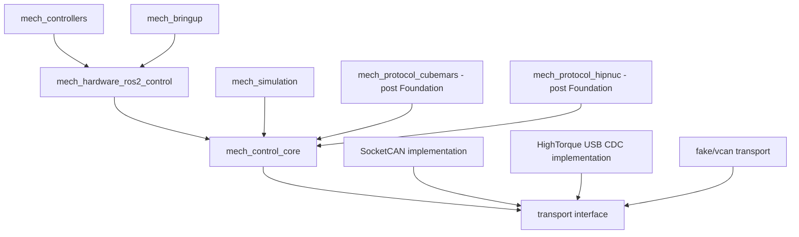

# Foundation v0.1 控制框架搭建计划

> 制定日期：2026-08-03
> 最近收敛：2026-08-24（FND-010～FND-014、RSP-002 与 INT-001 实现完成；FND-015 RC 验证中）
> 当前实施入口：本文件
> 当前状态：FND-000～FND-014、RSP-001/RSP-002 与 INT-001 已完成实现；FND-015 待补齐 ARM64、30 分钟稳定性与 vcan 证据
> 执行方向：先完成无真实硬件依赖的软件基础框架；电机、IMU 和实机配置在接口稳定后分工接入

## 1. 决策结论

**规划决定**：现在可以开始搭建控制框架。缺少两台定制 AKE60-8 和两台 HI12 的实机配置，不阻塞以下工作：

- Git 仓库、ROS 2 workspace、构建和 CI；
- 纯 C++ 核心类型、时间语义、配置校验和 capability；
- CAN transport 抽象、单写者 `BusRuntime`、路由、命令租约和状态快照；
- fake transport、虚拟时钟、模拟设备、vcan 和故障注入；
- 薄 ros2_control `SystemInterface`、模拟 C++ controller 和生命周期测试；
- 第三方项目复用评估和 ADR。

实机资料只阻塞：真实设备 profile 激活、最终 CAN ID/位速率/缩放、编码器来源、标准 `joint/effort` 锁定、真实硬件命令和 500 Hz/1 kHz 物理验收。

**组织决定**：Foundation v0.1 由项目负责人统一搭建。这样能在核心契约尚未稳定时减少跨人接口反复。Foundation API 冻结后，再把 CubeMars adapter、HI12 adapter、硬件 bring-up/测试分别交给其他成员。

## 2. 当前起点

| 项目 | 当前状态 | 对启动工作的含义 |
|---|---|---|
| 总体架构 | 已确定“纯 C++ 核心 + 薄 ros2_control 适配层” | 可以开始编码核心边界 |
| 电机协议资料 | **2026-09-01 起为 L07（AK3.0 V3.2.0）**，见 [ADR-013](../adr/ADR-013-ak30-protocol-baseline.md)；目标是力控扩展帧 + 伺服扩展帧，**先实现力控** | 不阻塞接口、golden vectors 和模拟器；阻塞真实激活 |
| HighTorque 资料 | `hightorque_fdcan` 提供 USB CDC raw CAN/CAN-FD 透传示例 | 只提炼 transport contract 和离线 framing/parser；不原样使用会打开串口/`exit(1)` 的 `canport` |
| HI12 | 通用 J1939/CANopen 资料存在，交付固件未知 | Foundation 只保留 sensor capability，不选现场 profile |
| 控制频率 | 当前两电机正常目标 500 Hz；框架支持 1 kHz 测试 | 测试和配置从第一天支持多速率，不承诺真实硬件性能 |
| Git | `main` 已建立并推送；FND-000～FND-004 已完成 | FND-004A 前继续完成 smoke 准备；通过后按 D5 打里程碑 tag 并保护 `main` |
| 供应商资料 | `CubeMars/` 是独立嵌套 Git 仓库 | 主仓库必须忽略它，避免误提交为 gitlink 或复制供应商资产 |
| 实现代码 | 五个 Foundation package 骨架、manifest、Docker/CI 与 build/context/ADR 检查脚本已存在 | 先完成 FND-004A，再从 FND-005 写核心类型；不提前写厂商 adapter |
| 目标平台 | 目标 Jetson 已于 2026-08-23 迁移为 Ubuntu 22.04.5 / JetPack 6.2 并装好 ROS 2 Humble；当前主开发工作区为 Ubuntu 22.04 x86_64 | 构建与 vcan 测试在 Ubuntu 22.04 环境执行；ARM64 结论只来自目标 Jetson |

`03_mvp_delivery_plan.md` 仍是包含真实硬件和完整 MVP 的总路线；本文件取代它作为当前 Foundation 阶段的具体执行顺序。

## 3. Foundation v0.1 的成功定义

Foundation v0.1 必须在没有真实电机和 IMU 的情况下贯通：

```text
C++ demo controller
  -> ros2_control command interface
  -> thin composite SystemInterface::write()
  -> canonical command + validation + lease
  -> BusRuntime TX scheduler
  -> fake/vcan transport
  -> simulated device
  -> feedback frame
  -> BusRuntime RX + router + simulated codec/session
  -> latest state snapshot
  -> SystemInterface::read()
  -> controller state
```

完成后应证明的是：架构边界、生命周期、命令/状态流、时间与故障规则可工作。它不证明真实 CubeMars/HI12 已兼容，也不证明物理力矩准确或系统已经达到硬实时。

### 3.1 Foundation 必须包含

- 可复现的私有 Git 仓库和 Ubuntu 22.04 / ROS 2 Humble 构建环境；
- 纯 C++17 核心库，不依赖 ROS 消息、rclcpp 或 pluginlib；
- 可替换 transport、clock、codec/session 和 device registry 边界；
- fake transport + virtual clock，支持无 sleep 的确定性单元测试；
- Linux SocketCAN/vcan 集成路径，以及可替换的 HighTorque USB-CDC raw-frame transport backend；
- 一个配置驱动的复合 ros2_control `SystemInterface`；
- 一个只用于模拟的 reference motor/device profile；
- 一个可配置、有界、带 slew 和 TTL 的最小 C++ demo controller；
- lifecycle、路由冲突、stale state、命令超时、丢帧、重复帧、乱序、queue-full 和 bus fault 测试；
- 文档、ADR、依赖清单和新 adapter 模板。

### 3.2 Foundation 明确不包含

- 真实 AKE60-8、HI12 或 STM32 的激活和运动命令；
- 把标准 AKE60-8 参数硬编码为定制实机事实；
- 最终 PID、滑模、阻抗、学习控制或人体实验控制器；
- PREEMPT_RT 安装、Jetson 系统改动或真实 CAN 配置；
- 六电机实机集成、自动固件更新、自动协议探测或 ACTIVE 期间 profile 切换；
- Web UI、数据库、云端服务或复杂微服务拆分。

## 4. 依赖方向和模块边界



| 模块 | Foundation 职责 | 禁止依赖/行为 |
|---|---|---|
| `mech_control_core` | 帧、时间、配置、capability、路由、状态快照、command lease、BusRuntime、错误和统计 | 不依赖 ROS；不含厂商位域；不写日志/磁盘/DDS |
| `mech_simulation` | fake clock/transport、reference codec/session、模拟设备和故障脚本 | 不假装是真实设备；不写供应商默认值 |
| `mech_hardware_ros2_control` | lifecycle、接口导出、claim、非阻塞 `read/write`、core 配置映射 | 不编解码厂商帧；不在 `read/write` 阻塞 socket |
| `mech_controllers` | 最小有界 demo controller；后续控制器模板 | 不打开 CAN；不分支判断电机型号 |
| `mech_bringup` | xacro/URDF、launch、模拟部署配置、controller 配置 | 不保存秘密；不把未知实机参数补成默认值 |
| transport backends | SocketCAN 与注入式 HighTorque USB-CDC 实现同一 `RawCanFrame` 契约 | 不含电机/HI12 位域；不在构造函数中退出进程 |
| vendor protocol packages | Foundation 后实现纯 codec + device session + golden frames | 不拥有 transport/串口/socket；不得修改上层控制器以适配品牌 |

### 4.1 “薄 SystemInterface”的准确含义

`SystemInterface` 不直接“抽象整个 CAN 协议”。它负责把 ros2_control 生命周期和标准接口连接到 canonical core：

- `read()` 读取 core 已发布的完整状态快照；
- `write()` 校验并提交 canonical command；
- `on_configure()` 创建经配置验证的 bus/device sessions；
- `on_activate()` 检查状态新鲜度、neutral 和 capability；
- `on_deactivate()` 停止命令续租并执行已定义的 neutral 策略。

厂商 CAN 位域由 protocol codec 处理，有状态的握手、反馈聚合和命令 profile 由 device session 处理，总线收发和调度由 `BusRuntime` 处理。这样未来接入达妙或其他 CAN 电机时，兼容的 C++ controller 和 ros2_control 接口不需要改。

## 5. 仓库、资产与治理基线

FND-000～FND-003 已完成建仓、资产隔离、依赖和 CI 基线；详细确认记录见 [FND-000 仓库与资产政策](fnd-000_repository_and_asset_policy.md)，当前事实以 Git、manifest 和 CI 为准。

| 项目 | 当前基线 |
|---|---|
| 主仓库 | 私有 `Makoto20S/jetson_mech_control`；当前 HEAD/branch/status 不写死在规划正文 |
| 跟踪内容 | 代码、配置、测试、ADR、正式文档、manifest 和经许可审查的小型测试向量 |
| 排除内容 | 独立 `CubeMars/`、`company/`(供应商现场资料)、供应商二进制、生成物、大日志/抓包、`tmp/`、`.codex/`、`.agents/` |
| 本地恢复 | `memory/` 由每位开发者本地维护并被 Git 忽略；共享任务进入 Issues/Milestones/PR |
| 当前 packages | 只创建 `mech_control_core`、`mech_simulation`、`mech_hardware_ros2_control`、`mech_controllers`、`mech_bringup`；vendor packages 在契约稳定后按需创建 |
| 治理切换 | FND-004A 通过后给实测 commit 创建 `fnd-004a-passed` tag 并保护 `main`；FND-005 起所有人经任务分支和 PR 合并 |

禁止宽泛暂存导致供应商/生成资产进入索引。公开、增加第三方代码、配置 CODEOWNERS 或提高 mandatory approval 前均需独立审查；未知评审账号不得写入规则。

## 6. 构建和运行环境

### 6.1 支持矩阵

| 层级 | 环境 | 用途 | Foundation 要求 |
|---|---|---|---|
| Edit | Windows 当前工作区 | 编辑、文档、Git | 不要求原生运行 ROS 2 Humble |
| Build/Unit | Ubuntu 22.04 + ROS 2 Humble 容器或原生机 | colcon、unit、golden、lint | 每个 PR 必须通过 |
| Linux integration | Ubuntu 22.04 原生/合适 runner | vcan、SocketCAN、线程和时间戳测试 | 独立 CI job，通过后才能合并 transport |
| ARM64 smoke | 目标 Jetson | clean clone、context、依赖和五包原生 build/test | FND-004 后、FND-005 前通过 |
| ARM64 RC | Jetson 或 ARM64 runner | 完整 clean build、sanitizer、性能和稳定性 | Foundation RC 前通过 |
| HIL | Jetson + 实验硬件 | 后续真实设备验收 | Foundation 不执行 |

### 6.2 基准工具链

- Ubuntu 22.04、ROS 2 Humble、C++17、CMake/ament_cmake、colcon、rosdep；
- 编译器警告至少 `-Wall -Wextra -Wpedantic`，项目代码 warning-as-error；
- `ament_cmake_gtest`/GoogleTest 做单元测试；
- `ament_lint_auto`、clang-format、clang-tidy 规则逐步启用；
- ASan/UBSan 进入专用 CI，TSan 在可行 package 上运行；
- vcan 和 can-utils 只用于 Linux integration job；
- 构建容器/runner 版本必须进入 host/dependency manifest，不依赖浮动 `latest`。

当前共享脚本由 CI/Docker 与匹配的原生主机复用；官方 `rosdep` 是默认标准：

```bash
source /opt/ros/humble/setup.bash
MECH_OUTPUT_ROOT=/tmp/jetson-mech-control-build \
bash tools/ci/build_workspace.sh
```

已配置国内镜像的主机可以显式运行 `rosdepc update --rosdistro humble`，并以 `ROSDEP_COMMAND=rosdepc` 调用同一脚本。x86_64 `Ubuntu-22.04` 中两种 resolver 路径都完成 5 包构建和 30/30 测试，GitHub Actions 也从 clean checkout 完成 context check 和 pinned Humble Docker build。具体提交与 run 证据保留在 GitHub Checks/历史中；该证据不覆盖 ARM64、vcan、性能或硬件。

## 7. 四周 Foundation 路线

### Week 1：仓库、ADR、构建骨架和核心契约

1. ~~完成仓库/许可证/资产策略决策~~（FND-000 已完成）；
2. ~~初始化 Git、私有远端、`.gitignore` 和规划基线~~（FND-001 已完成）；
3. ~~创建五个必要 packages、最小可构建目标和 CI~~（FND-002/FND-003 已完成）；
4. ~~将 ADR-001/002/003/004/005/006/009 转成独立 ADR~~（FND-004 已完成，6 Accepted、1 Proposed）；
5. 在目标 Jetson 上完成 FND-004A ARM64 原生烟测；
6. 烟测通过后创建 `fnd-004a-passed` tag、保护 `main`，再从 FND-005 开始以任务分支 + PR 开发；
7. 实现 frame/time/status/config/capability 的纯 C++ 类型与验证测试。

**Week 1 出口**：干净 checkout 可在 Ubuntu 22.04 执行 build + unit；错误配置测试失败方式确定；没有 transport 线程和真实设备代码。

### Week 2：fake transport、router、BusRuntime 和复用 spike

1. 实现 fake monotonic clock 和 fake transport；
2. 实现 frame router、filter overlap 检查和显式 fan-out；
3. 实现最新状态快照、command generation/deadline 和有界 command slot；
4. 实现单写者 BusRuntime 的 start/stop/RX/TX 基本状态机；
5. 完成 `ros2_socketcan` 与直接 Linux RAW SocketCAN 的复用对比，形成 ADR；
6. 对 `hightorque_fdcan` 做独立 transport spike：CDC header/CRC、`MODE_FDCAN_PASS` 批量帧、标准/扩展/Classic/FD/BRS 标志、长度边界、版本/VID-PID/端口身份、队列/错误/时间戳和 bitrate 配置能力；只用 fake serial/golden vectors，不打开真实 `/dev/ttyACM*`；
7. 用虚拟时间跑 drop/duplicate/reorder/stale/queue-full/bus-off 状态测试。

**Week 2 出口**：无 ROS 的测试可确定性重放相同事件并产生相同状态/计数；无 sleep 测试不依赖真实 CAN。

### Week 3：vcan、模拟设备和 ros2_control 纵向链路

1. 按 transport ADR 实现/封装 SocketCAN；
2. 增加 vcan smoke/integration job；
3. 实现只用于测试的 `loopback_v1` codec/session 和 reference motor simulator；
4. 实现复合 `SystemInterface` 生命周期、接口导出和非阻塞 `read/write`；
5. 实现最小 demo controller；
6. 打通 controller -> fake/vcan -> simulated device -> state 的完整链路。

**Week 3 出口**：模拟系统可 configure/activate/deactivate，controller 可启动/停止，命令过期后在规定虚拟周期内失效；controller 和 SystemInterface 都不含厂商 CAN 字段。

### Week 4：故障、性能、文档和 Foundation release

1. lifecycle 重复、STRICT controller switch、stale state 和 fault-latch 测试；
2. nominal/stress 下记录 controller loop、command-to-transport、state age、queue 和 allocation 指标；
3. 验证 500 Hz 配置和 1 kHz 候选配置，但明确是模拟/主机指标；
4. ARM64 clean build、sanitizers、30 min 模拟稳定性运行；
5. 冻结 `AdapterContract v1`、配置 schema v1 和新设备接入模板；
6. 生成 `v0.1.0-foundation` release candidate 和已知限制。

**Week 4 出口**：Foundation Definition of Done 全部满足，设备适配任务可以并行拆分，真实硬件仍保持禁止激活。

## 8. 可直接创建的 Issue 清单

| ID | Issue | 依赖 | 主要交付 | 完成标准 |
|---|---|---|---|---|
| FND-000 | 决定 repo 名、license、资产和 memory 策略 | 无 | decision record | 五项初始 Git 决策均有负责人和结论；D4 修订记录可追溯 |
| FND-001 | 初始化私有 Git 主仓库 | FND-000 | main、remote、ignore、AI 协作规范/skill manifest、baseline commit | clean clone 可看到正式规划和 AI 入口且不含个人 Memory、供应商或临时资产 |
| FND-002 | 固定 Ubuntu/Humble dependency manifest | FND-000 | rosdep/容器/host manifest | 新环境可复现依赖安装 |
| FND-003 | 创建最小 ROS workspace 与 CI | FND-001/002 | 五个 package、build/test/context workflow | clean build、空骨架测试和可移植上下文检查通过 |
| FND-004 | 建立 ADR 基线（已完成） | FND-001 | [ADR 索引与七份记录](../adr/README.md) | 6 Accepted、1 Proposed；每项有状态、后果、验证、重审触发和规划反向链接 |
| FND-004A | Jetson ARM64 原生早期烟测 | FND-003/004 | 环境记录 + clean-clone context/build/test 结果 | Jetson Ubuntu 22.04/Humble 原生执行 context check、依赖解析、5 包 build/test；记录 JetPack/L4T/ROS/GCC/CMake；不启用 CAN、不操作设备 |
| FND-005 | 定义 frame/time/status 类型 | FND-003/004/004A | pure C++ headers/sources/tests | 边界、无效 DLC/ID/时间测试通过 |
| FND-006 | 定义 config/capability/schema v1 | FND-005 | typed config + validator | 缺字段、重复 ID、未知 profile 可被拒绝 |
| FND-007 | 实现 fake clock 和 fake transport | FND-005 | deterministic test doubles | 无 sleep 控制时间和帧顺序 |
| FND-008 | 实现 FrameRouter 和 filter 校验 | FND-006/007 | route registry/tests | 重叠、标准/扩展和 fan-out 测试通过 |
| FND-009 | 实现 snapshot、lease 和 BusRuntime | FND-007/008 | 单写者 runtime/tests | stale/TTL/queue/fault 状态可重复验证 |
| RSP-001 | 评估多 transport backend（SocketCAN 与 HighTorque USB-CDC） | FND-004/005 | [离线 transport 评估记录](rsp-001-transport-evaluation.md) | SocketCAN 直接 RAW socket 作为 FND-010 目标；HighTorque USB-CDC 保留候选并显式记录缺失能力；无硬件副作用 |
| FND-010 | 实现选定 Linux SocketCAN transport | FND-009/RSP-001 | non-blocking adapter + vcan tests | filter、error frame、timestamp、queue 结果通过 |
| RSP-002 | 实现/评估 HighTorque USB-CDC raw-frame transport | FND-009/RSP-001 | injected serial + CDC golden/negative tests | CRC、批量帧、标准/扩展/Classic/FD/BRS、断连/队列/版本失败语义通过；不直接依赖 `canport` |
| FND-011 | 实现 loopback codec 和模拟设备 | FND-009 | reference session/simulator | 命令产生可预测反馈和故障 |
| FND-012 | 实现薄复合 SystemInterface | FND-006/009/011 | lifecycle plugin/tests | `read/write` 非阻塞且无厂商字段 |
| FND-013 | 实现最小 C++ demo controller | FND-012 | controller plugin/tests | 可配置目标、限幅、slew、TTL 和回零通过 |
| FND-014 | 完整 lifecycle/switch/fault 测试 | FND-010/RSP-002/012/013 | integration suite | 重复生命周期、STRICT switch、backend capability/断连指标通过 |
| FND-015 | 性能、ARM64 和 Foundation RC | FND-014 | benchmark/report/tag candidate | Definition of Done 全部有实际证据 |
| INT-001 | 冻结新 device adapter 模板 | FND-015 | template/checklist/example | 新 adapter 无需修改 controller/core 公共语义 |

严格执行顺序不是“先写 CubeMars driver”。共享主线仍按 `FND-000 -> FND-001/002 -> FND-003 -> FND-004 -> FND-004A -> FND-005...015 -> INT-001`；Foundation 内含 simulation 与 transport spikes。`INT-001` 冻结 adapter 模板后，依次实现 AK3.0 力控 codec/session，再实现 AK3.0 伺服 codec/session；真实设备始终受 G0-G3 约束。

### 8.1 FND-004 完成结果

FND-004 已完成架构决策固化；该任务没有写运行时代码，也没有连接 Jetson/CAN。正式入口为 [ADR 索引](../adr/README.md)：

| ADR | Status | 已冻结的问题 |
|---|---|---|
| [ADR-001](../adr/ADR-001-core-boundary.md) | Accepted | 纯 C++ 核心与薄 ros2_control 适配层的边界 |
| [ADR-002](../adr/ADR-002-bus-runtime-ownership.md) | Accepted | 每条物理 CAN 总线的单写者 `BusRuntime` 所有权 |
| [ADR-003](../adr/ADR-003-composite-system-interface.md) | Accepted | Foundation/MVP 复合 `SystemInterface` 的生命周期与拆分触发条件 |
| [ADR-004](../adr/ADR-004-fixed-protocol-profile.md) | Accepted | 协议代际和 active command profile 在 ACTIVE 期间不可自动猜测或混发 |
| [ADR-005](../adr/ADR-005-monotonic-time-freshness.md) | Accepted | 单调时钟、源时间、到达时间和 freshness/TTL 的语义 |
| [ADR-006](../adr/ADR-006-conditional-can0-deployment.md) | Proposed | 当前单物理通道及其 backend 只是等待逐台配置、能力和总线证据的条件式 profile；架构保留双总线 |
| [ADR-009](../adr/ADR-009-effort-semantic-gate.md) | Accepted | 标准 `effort` 的物理语义闸门，框架 demo 与力矩精度分开验收 |
| [ADR-012](../adr/ADR-012-command-watchdog-and-capability-honesty.md) | Accepted | 命令看门狗分级语义（跟随/冻结/失败）、transport 能力三态上报与远程帧表达；Foundation RC 评审后的追认记录，2026-08-31 复核转 Accepted，仅约束接口语义、不解除设备启用闸门 |
| [ADR-013](../adr/ADR-013-ak30-protocol-baseline.md) | Proposed | 协议资料基线由 L02（AK2.0 驱动器手册）切换为 L07（AK3.0 产品手册）；客观依据是本项目驱动板 `AK54-4810-1C-A2` 只出现在 L07。`ProtocolProfile` 随之重定义，力控提为第一 profile |

七份 ADR 均包含状态、日期/owner role、上下文、决策、替代、正负后果、可执行验证、重审触发和来源。ADR-006 的 Proposed 状态是有意的失败关闭边界，不是 FND-004 遗漏；它必须等 G0/G1 和负载/仲裁/错误证据后才能转为 Accepted。后续 FND-005～009 直接引用这些接口边界。

### 8.2 文档收敛结果

FND-004 后的独立文档收敛已执行：

- `01_evidence_and_research.md`、`04_source_register.md`、`06_cubemars_material_review.md` 保留为证据/来源层，并明确快照与当前事实的边界；
- `02_architecture_and_interfaces.md` 与 `05_decisions_and_open_questions.md` 已减少重复决策正文，直接链接正式 ADR；
- `03_mvp_delivery_plan.md` 保留完整 MVP、硬件闸门、带宽与量化验收；本文件继续负责 Foundation 顺序和核心契约；
- 初始总体规划提示词已移入 [`docs/archive/`](../archive/README.md) 并标记 non-normative；活动文档不把归档作为当前规范；
- [规划索引](README.md)现在只提供权威边界、当前顺序和活动文档地图。

后续完成项的详细进度进入 GitHub Issues/Milestones/PR，正式文档只保留可长期复现的结果和接口边界。

## 9. Foundation 核心契约

### 9.1 CAN frame 与 transport

`RawCanFrame`/等价类型至少表达：logical bus、11/29-bit ID、Classic/FD、DLC、固定容量 payload、RX/TX 方向、transport/source timestamp（若 backend 提供）、host monotonic arrival、时间戳 capability 和错误标志。类型自身拒绝非法 ID/DLC，不把标准/扩展信息藏在 ID 高位魔数中，也不把 CDC header/CRC 混进设备 payload。

Transport 契约至少支持：

- configure/open/close 与明确状态；
- non-blocking `try_receive` / `try_send`；
- filter 和 error-mask 配置；
- RX/TX/overflow/drop/error/bus state 统计；
- 可选 kernel/hardware timestamp capability；
- fake、SocketCAN 和 HighTorque USB-CDC 使用相同上层契约；backend 不具备的 filter/timestamp/error 能力必须显式报告，不能伪造。

Transport 不负责协议缩放、设备生命周期、重发历史命令或 ROS 发布。

### 9.2 Codec 与 DeviceSession

- Codec 是纯编解码：ID、DLC、字节序、位域、缩放和范围；不打开 socket、不启动线程。
- DeviceSession 持有设备状态：配置 profile、反馈聚合、新鲜度、序号、错误、命令 capability 和 neutral 语义。
- 实例在 configure 阶段由 registry/factory 创建；ACTIVE 期间不动态发现类型。
- 周期路径使用预分配固定容量对象；初始化阶段可以进行配置解析和分配。
- vendor codec 的 golden frame 必须能脱离 ROS、SocketCAN、USB CDC 和真实硬件运行。

### 9.3 Canonical state/command

Canonical state 至少保存 value、valid、quality、source time、host RX time、age、sequence/generation 和原始故障码。Canonical command 至少保存 producer generation、value、mode、deadline、limits result 和提交时间。

只有已证明物理语义的字段才能映射为标准 SI：

- position：rad；
- velocity：rad/s；
- effort：N*m；
- IMU：SI 单位和明确坐标系。

无法证明的字段使用显式 raw/vendor interface 或保持不可用，不通过相似命名伪装。

### 9.4 CommandLease

每个可写资源只有一个当前 generation 的最新命令。提交和发送必须检查 finite、claim/mode、capability、limit、slew、state freshness 和 deadline。队列拥塞时覆盖/丢弃旧周期命令，不在恢复后补发历史命令。controller 不再刷新时，旧命令必须在 TTL 到期后失效。

### 9.5 配置 schema v1

配置分三层：

1. `device profile`：协议代际、capability、单位映射和允许范围；
2. `robot config`：实例、关节/传感器命名、方向、零位和约束；
3. `deployment`：logical bus 到 `can0/can1/vcan/fake` 或 HighTorque USB CDC 设备/通道的映射、位速率、频率、transport capability 和线程策略。

模拟 profile 可以有完整默认值；真实设备关键字段缺失时 configure 必须失败。配置必须带 `schema_version`，升级通过显式迁移，不静默改变语义。

## 10. 代码复用计划

### 10.1 立即采用或选择性采用

| 项目 | 计划 | 复用范围 | 不复用范围 |
|---|---|---|---|
| ros2_control/controller_manager | 采用 | lifecycle、resource claim、`read/update/write`、controller switch | 不把协议或总线调度塞进 hardware plugin |
| ros2_controllers | 选择性采用 | joint state/IMU broadcaster 等标准组件 | 不用其替代项目 command lease/quality 契约 |
| ros2_control_demos | 参考 | package、plugin、URDF、测试组织方式 | 不复制 demo 硬件逻辑作为生产架构 |
| realtime_tools | 条件采用 | 非 RT 到 RT 的小型固定快照交换 | 基准前不宣称 lock-free，不直接承载大对象 |
| can-utils | 外部工具采用 | candump/canplayer/cangen/canbusload 诊断 | 不链接到控制核心，不让 CLI 成为命令 owner |
| rosbag2 | 后续采用 | ROS 状态/诊断/实验记录 | 不替代线速 CAN 回放和仲裁测试 |
| ament/GoogleTest/lint | 采用 | 构建、单测、格式和静态检查 | 不自建重复测试框架 |

### 10.2 必须先做 spike 再决定

RSP-001 同时评估 SocketCAN 与 HighTorque USB-CDC 两类 backend；`ros2_socketcan` 只评估其底层 sender/receiver API 或实现思路，不采用“独立 ROS 节点 + DDS”作为电机闭环。它必须回答：

1. Humble 分支实际许可证和依赖能否进入私有/未来开源项目；
2. API 是否支持 non-blocking、精确 filter、error frame 和 timestamp；
3. 线程由谁拥有，能否嵌入单一 `BusRuntime`；
4. ACTIVE 路径是否发生动态分配、日志或无界阻塞；
5. Ubuntu 22.04/Humble/ARM64 能否构建；
6. wrapper PoC 是否比直接 Linux RAW socket 更小、更可测；USB-CDC backend 还必须回答板卡/固件矩阵、稳定端口身份、nominal/data bitrate 所有权、CDC CRC/批量帧边界、断连、时间戳和错误语义。

SocketCAN 只有前六项通过才封装使用，否则实现最小 Linux RAW socket RAII adapter。HighTorque backend 只能依据 L16 重新实现可注入 transport；在独立许可证、准确板卡/固件和缺失能力闭合前，不复制或直接依赖原 `canport` 类。

### 10.3 设备协议项目只作参考

- `cubemars_hardware`：参考 ros2_control 映射和硬件经验；型号/生命周期/许可边界不足以直接依赖；
- `motor-control-sdk`：参考 AK V3 force-control 字段，不能继承硬编码 AKE60-8 参数或 C++23/Bazel 体系；
- `mini-cheetah-tmotor-can`、`tmotor-ak-actuators-driver`：**不得作为交叉旁证**。它们实现的是旧式 11 位标准帧 MIT，与 AK3.0 力控的 29 位扩展帧和 `KP KD 位置 速度 力矩` 位序都不同；当前实现以 L07（AK3.0）为准；
- `Panthera-HT_ROS2`：参考 ros2_control/配置组织和 HighTorque 厂家电机语义，不作为 core 或 HI12 实现；
- `hightorque_fdcan`：只参考 USB CDC raw-frame protocol/behavior；不复用构造即开设备、进程退出和自有线程所有权；
- `cubemars_servo_can`：只作 servo 报文对照，不进入 C++ RT 路径；
- `hipnuc/products`：只作 HI12 字段/DBC 对照，交付固件和手册冲突必须逐项解决。

复制任何第三方代码前必须固定 commit、保存许可证证据、标明修改，并通过当前手册/golden frame 验证。没有明确许可证的项目只允许阅读，不复制实现。

### 10.4 当前明确延后

- `ros2_canopen`/Lely：只有 HI12 确认为 CANopen 交付固件后再做专用 spike；
- CANopenNode/libcanard：仅在未来 STM32 协议决策需要时评估；
- 外骨骼整机项目：参考命名和工作流，不形成运行依赖；
- Python/GPU 学习控制：Foundation 完成且 C++ fallback/TTL 稳定后再接入。

## 11. 测试策略和 Definition of Done

### 11.1 测试层次

| 层 | 测试内容 | 硬件 |
|---|---|---|
| Unit | frame、codec、config、capability、时间、lease、状态机 | 无 |
| Property/fuzz | DLC/ID/字节边界、随机无效帧、parser 不崩溃 | 无 |
| Deterministic simulation | virtual clock、drop/duplicate/reorder/stale/fault | 无 |
| vcan integration | SocketCAN filter、fan-out、error/queue、进程内 BusRuntime | Linux vcan |
| USB-CDC contract | CDC header/CRC、批量 raw frames、标准/扩展、Classic/FD/BRS、malformed length、断连和 queue-full | fake/injected serial，无真实设备 |
| ros2_control integration | lifecycle、interface claim、controller switch、TTL | fake/vcan |
| Performance | 500 Hz/1 kHz 配置的 loop dt、command-to-transport、state age | 无真实设备 |
| ARM64 | clean build、unit、模拟 smoke | Jetson/ARM64，无 CAN |
| HIL | 真实协议、总线、物理行为 | Foundation 后 |

### 11.2 Foundation v0.1 验收

- clean checkout 在固定 Ubuntu/Humble 环境 build/test 通过；
- core package 的公共头不包含 ROS headers；
- fake virtual-time 测试无 sleep 且可重复；
- route overlap、重复 ID、标准/扩展冲突和超负载配置会拒绝 configure；
- 每条 bus 只有一个可写 BusRuntime；测试能检测第二 writer；
- `read()`/`write()` 不等待 CAN 帧，不执行文件/DDS/字符串格式化；
- controller 停止刷新后，命令在配置 TTL 内失效；
- state timestamp 不因重复 `read()` 被改成当前时间；
- lifecycle configure/activate/deactivate/cleanup 连续 100 次无失败或资源增长；
- STRICT controller switch 100 次不越过配置 slew/limit；
- drop/duplicate/reorder/stale/queue-full/bus fault 均有明确计数和状态转移；
- vcan round-trip 和 SocketCAN filter/error/timestamp smoke 通过；HighTorque CDC framing/CRC/批量/断连离线测试通过，缺失 capability 明确失败；
- 500 Hz 模拟 nominal/stress 30 min 无 command backlog、状态伪刷新或未解释 drop；
- 1 kHz 能配置并记录实际表现，但不要求优于 500 Hz，也不宣称真实硬件可用；
- ASan/UBSan、ARM64 build、Markdown/ADR/schema 检查通过；
- `AdapterContract v1` 和一个 reference adapter 模板可供后续成员使用。

## 12. Foundation 后的分工方式

Foundation API 冻结并打 `v0.1.0-foundation` RC 后再拆分：

| 工作流 | 主要职责 | 不能修改的边界 | 交付 |
|---|---|---|---|
| Core/ros2_control owner | 维护 core、SystemInterface、CI 和 schema | 不加入厂商 if/else | API review、release、集成测试 |
| CubeMars owner | AK3.0 力控（先）、AK3.0 伺服扩展帧（后）的 codec/session/golden/sim；AK V3 补充 profile | 不直接打开 socket，不改 controller，不混发 profile | `mech_protocol_cubemars` + evidence |
| HI12 owner | 识别交付协议、J1939/CANopen codec、坐标/时间/质量 | 不用 host now 替代 sample time | `mech_protocol_hipnuc` + evidence |
| Integration/HIL owner | CAN 拓扑、配置、抓包、性能和故障试验 | 不跳过 G0~G3，不改协议常量 | deployment profile、原始证据和验收报告 |

任何 adapter 若需要改变 canonical 接口语义，先提交 ADR；不能为了一个品牌把厂商字段渗入 core 或现有 controllers。

## 13. 未来接入新 CAN 电机或传感器

新设备接入按固定清单执行：

1. 收集准确型号、固件、协议和配置证据；
2. 声明 capability、标准单位、raw 字段和 neutral/watchdog 语义；
3. 新建独立 protocol package；
4. 实现纯 codec 和 golden/negative/boundary tests；
5. 实现 DeviceSession、反馈聚合、freshness 和命令 profile；
6. 扩展模拟设备与故障注入；
7. 注册到 configure-time registry/factory；
8. 使用既有 SystemInterface 导出兼容状态/命令接口；
9. 通过 vcan 后才进入 G0~G3 真实 bring-up；
10. 只有出现真正新的标准语义时才扩展 canonical interfaces。

如果新电机能提供相同的 `position/velocity/effort` 语义，现有 C++ controller 不改；通常只新增 adapter、配置和测试。如果其“扭矩”实际只是电流或厂商归一化值，就不能冒充 `effort`，需要显式 raw/current interface 或完成物理映射。

## 14. 主要风险和控制点

| 风险 | 当前控制 |
|---|---|
| 没有实机资料导致停工 | 只把真实 profile 激活设为阻塞，Foundation 使用 reference profile |
| 过度抽象 | 每个抽象必须由 fake + 至少一个未来 vendor 用例验证；不提前创建空包 |
| 重写成熟基础设施 | ros2_control/ament/gtest/can-utils 直接复用；SocketCAN 与 HighTorque CDC 都先 spike |
| 直接复制不匹配 driver | 第三方设备代码只作参考，手册/golden/evidence 优先 |
| Windows 与目标环境差异 | build/test 事实只来自 Ubuntu 22.04/Humble 和 ARM64 job |
| 根仓库误包含供应商资产 | `.gitignore` 和 asset manifest 先于首次 `git add` |
| nested `CubeMars/.git` 被误加为 gitlink | 主仓库明确忽略 `CubeMars/`，首个 commit 审查 staged paths |
| RT 设计停留在口号 | 记录 allocation、blocking、loop dt、command-to-transport 和 state age |
| schema 在设备接入时崩溃式修改 | v1 分层为 profile/robot/deployment，升级显式迁移 |
| Foundation demo 被当最终控制器 | 包名、文档和验收都标注 reference/demo，只验证链路 |

## 15. 新对话和新成员的恢复顺序

权威通用流程是根 [`AGENTS.md`](../../AGENTS.md) 和 [AI 协作 SOP](../development/ai_collaboration_workflow.md)，本节不复制其 project-memory、handoff 和结束检查点规则。Foundation 只补充三个恢复入口：

1. 读 [规划索引](README.md)、本文件、[ADR 索引](../adr/README.md)和当前 GitHub Milestone/Issue；
2. 核对实际 branch/HEAD/status 与最近验证，不从归档、旧 memory 或旧 handoff 推断当前状态；
3. 当前以 [Foundation RC 验证清单](../development/foundation_validation.md)为 FND-015 闸门；确认自己位于任务分支而不是受保护 `main` 再编辑。

## 16. 立即执行顺序

当前下一步不是写真实设备协议，也不是连接硬件，而是：

1. FND-000～FND-014、RSP-001/RSP-002 与 INT-001 的实现已在任务分支形成三个语义 commit；
2. 本机五包 clean build/test（116 tests）和 ASan/UBSan 已通过；该计数包含 Foundation RC 评审后补充的回归测试。
3. **当前下一步是 FND-015 RC 取证**：在 exact commit 上完成 vcan 软件集成、Jetson ARM64 clean build/test 和 30 分钟模拟稳定性运行；
4. 通过同一个受保护 PR 合并，不在证据未完整前创建 `v0.1.0-foundation-rc1` tag；
5. RC 完成后才能开始真实 AK3.0/HI12 adapter，且仍需分别通过 G0～G3。

目标机依赖已满足，但仍未授权启用物理 CAN、发送电机命令或操作真实设备。ARM64 验证不得借此启用 CAN；如需安装缺失系统依赖，继续遵守目标机“只 `apt update` + `apt install`、禁止 `apt upgrade`”纪律（升级教程 §12.1）。
